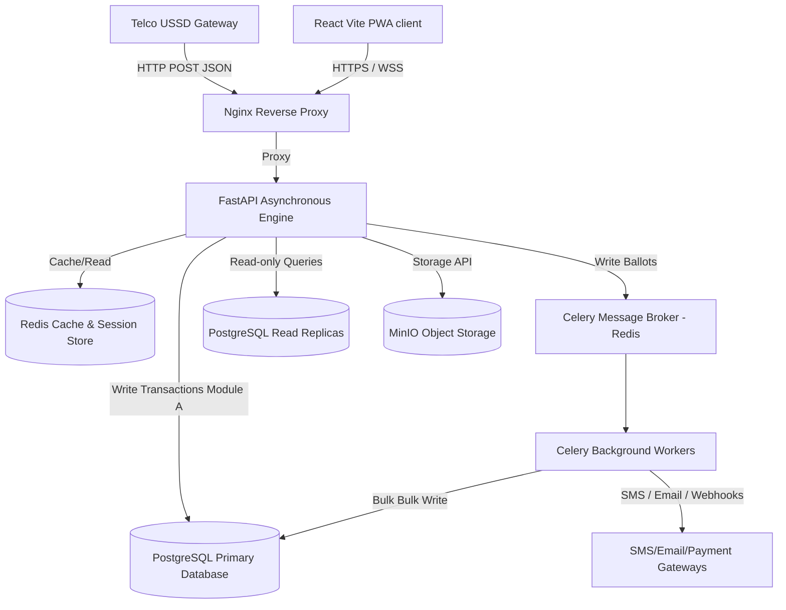
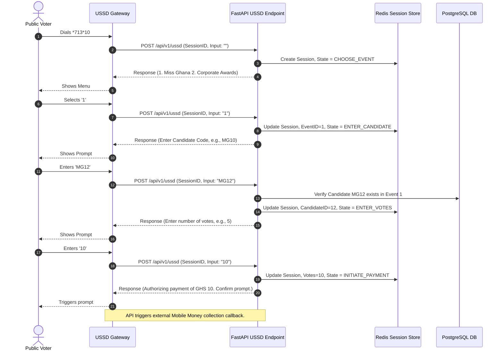
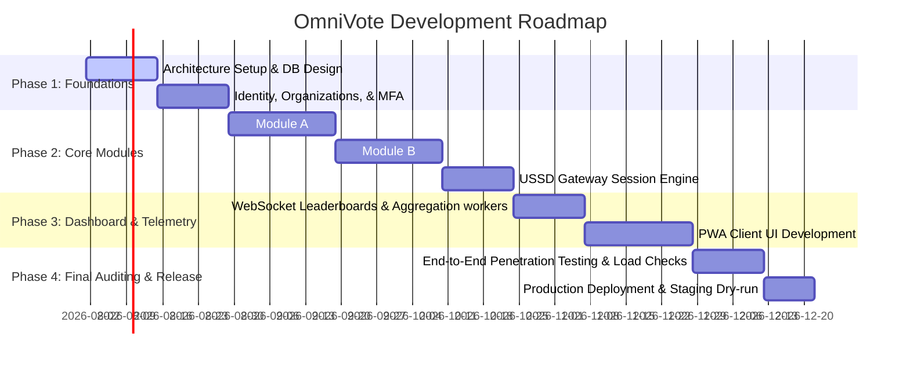

# OmniVote — Product Requirements Document (PRD) v1.0
**One System. Every Vote.**
*Powered by VeroSeven*

---

## 1. Executive Summary
OmniVote is a next-generation, cloud-native, secure, and multi-tenant SaaS voting platform designed to centralize and streamline the management of all forms of voting events. Built to cater to a diverse clientele ranging from educational institutions (universities, colleges, schools) to corporate environments, NGOs, associations, and commercial entertainment events (beauty pageants, public awards), OmniVote bridges the gap between pre-verified democratic processes and open-participation public events. 

By utilizing a robust modern technology stack comprising a React-based frontend, a FastAPI asynchronous backend, a PostgreSQL relational database, Redis caching, Celery-driven background queues, and WebSocket-based real-time telemetry, OmniVote guarantees performance, auditability, high availability, and security.

---

## 2. Problem Statement
Existing voting solutions are highly fragmented, inflexible, and architected around singular use cases. 
* **Standard democratic voting** (e.g., student representative councils, corporate boards, club elections) requires strict voter verification, preloaded lists, one-voter-one-vote enforcement, and precise eligibility checking. Current tools are often complex to set up, lack transparency, or cannot support complex group/gender-based constituency restrictions.
* **Public/Paid voting** (e.g., pageants, national music awards, talent shows) demands rapid scaling, anonymous access, candidate code lookups, integration with localized payment gateways (such as Mobile Money), and real-time public leaderboards.
* **System fragmentation** forces organizations to license and integrate multiple products, leading to data silos, administrative overhead, inconsistent user experiences, and security vulnerabilities.
* **SaaS limitations** mean existing platforms do not offer proper multi-tenant isolation, resulting in noisy-neighbor issues and complex configuration structures.

---

## 3. Vision Statement
To establish OmniVote as the global standard for digital voting by offering a singular, secure, highly customizable, and resilient platform that accommodates both closed, high-security democratic elections and high-throughput, monetization-friendly public voting contests, ensuring that every vote is captured, verified, and accounted for transparently.

---

## 4. Business Goals
* **Establish a Multi-Tenant SaaS Model:** Enable rapid, self-service onboarding for diverse organizational tiers.
* **Diversify Revenue Streams:** Monetize standard elections through transactional or seat-based tier licensing, and paid voting through revenue-sharing cuts on Mobile Money payments (e.g., 5% to 15% per vote).
* **Maximize Market Reach:** Capture the educational sector (SRC/faculty elections) and the entertainment sector (pageants, public awards) within the sub-Saharan African market and beyond.
* **Guarantee Regulatory Compliance:** Build a transparent, auditable system complying with data privacy regulations (e.g., GDPR, NDPR).

---

## 5. Success Metrics

| Metric | Target | Measurement Method |
| :--- | :--- | :--- |
| **System Availability** | 99.95% uptime during active elections | Prometheus/Grafana synthetic monitoring |
| **Transaction Processing Speed** | Paid votes processed under 1500ms end-to-end | API gateway telemetry, webhook processing logs |
| **Real-time Dashboard Latency** | WebSocket update push latency < 200ms | Client-side performance metrics |
| **USSD Menu Response Time** | < 1000ms from request to response | USSD Gateway logs |
| **Voter Conversion Rate** | > 95% completion rate for initiated votes | Funnel analysis via web analytics |
| **Audit Log Integrity** | Zero unauthorized adjustments or modifications | Daily cryptographic validation scripts |

---

## 6. Functional Requirements

### 6.1 Multi-Tenant Organization Management
* **FR-1.1:** The system shall support creation and isolation of multiple client organizations.
* **FR-1.2:** Each organization shall possess unique configurations, sub-domains, styling, and billing settings.
* **FR-1.3:** Administrators shall be bound to specific organizations with strict separation of data.

### 6.2 Module A — Standard Elections
* **FR-2.1:** Administrators shall upload voter registers containing columns for `VoterID`, `FullName`, `Email`, `PhoneNumber`, `Gender`, `Level/Year`, and `Department/Group`.
* **FR-2.2:** The system shall enforce a strict "one verified vote per category" policy based on structural configurations.
* **FR-2.3:** The platform shall support restricted categories based on voter metadata (e.g., "Women's Commissioner" voting limited to female voters; "Level 300 Representative" limited to level 300 students).
* **FR-2.4:** Standard elections must generate secure OTPs distributed via SMS and email for voter authentication.
* **FR-2.5:** The platform must generate real-time admin dashboards and audit logs for tracking voter turnout.

### 6.3 Module B — Paid & Event Voting
* **FR-3.1:** The system shall allow public, anonymous access for voting on events without registration.
* **FR-3.2:** The system shall process multiple votes from a single voter, limited only by payment success.
* **FR-3.3:** Candidates must be assigned unique alphanumeric candidate codes (e.g., `OV-101`, `OV-102`) for easy reference.
* **FR-3.4:** The backend shall integrate with local Mobile Money gateways (MTN MoMo, Telecel Cash, AT Money, Hubtel, Paystack) to collect payments per vote.
* **FR-3.5:** The system shall expose a USSD menu tree allowing users to vote by dialling a shortcode, entering candidate codes, selecting quantity, and completing payment prompts.
* **FR-3.6:** The platform shall support public-facing real-time leaderboards with optional configurable latency delays.

### 6.4 Shared Administrative Features
* **FR-4.1:** Admin dashboard containing election analytics, financial breakdowns, voter turnout charts, and audit trail viewers.
* **FR-4.2:** Role-Based Access Control (Super Admin, Organization Admin, Auditor, Election Officer).
* **FR-4.3:** Multi-factor authentication (MFA) for administrative accounts.

---

## 7. Non-functional Requirements

### 7.1 Security & Compliance
* **NFR-1.1:** All communication must be encrypted in transit via TLS 1.3 and at rest using AES-256.
* **NFR-1.2:** Voter identity verification tokens (OTPs) must expire after 10 minutes and support rate limiting (maximum 3 requests per IP/number per 15 minutes).
* **NFR-1.3:** Voter ballots must be cryptographically decoupled from voter identities to ensure vote secrecy.

### 7.2 Scalability & Performance
* **NFR-2.1:** Module B must scale horizontally to handle up to 5,000 requests per second (RPS) during peak television award announcements.
* **NFR-2.2:** API responses must return in less than 200ms under nominal load (95th percentile).
* **NFR-2.3:** DB transactions for vote increments must utilize distributed lock mechanisms to avoid race conditions and double-voting.

### 7.3 Reliability & Availability
* **NFR-3.1:** Database replication configuration: One primary writer, two read replicas.
* **NFR-3.2:** Automatic failover time for the primary database node must be less than 30 seconds.

### 7.4 Usability & Accessibility
* **NFR-4.1:** Client-side interface must comply with WCAG 2.1 Level AA requirements.
* **NFR-4.2:** The mobile experience must operate seamlessly over slow networks (Edge/3G) with page sizes under 1.5MB on initial load.
* **NFR-4.3:** Progressive Web App (PWA) capabilities must include offline caching of static assets and local validation states.

---

## 8. User Personas

### 8.1 Isaac — The University Election Administrator (Module A User)
* **Demographics:** 34 years old, IT Administrator at a national university.
* **Goals:** Configure student elections with 15,000 eligible voters across 12 departments, ensuring zero fraud and instantaneous results auditing.
* **Pain Points:** Hard to track student eligibility; manual complaints about voting access; fear of system failure during peak hours (12 PM - 2 PM).

### 8.2 Sophia — The Pageant Executive Producer (Module B User)
* **Demographics:** 42 years old, Founder of a regional beauty pageant.
* **Goals:** Maximize public engagement, track real-time revenue splits, and display a stunning live leaderboard during the televised grand finale.
* **Pain Points:** Payment delays causing missing votes; slow updates on pageants; high fees from payment gateways.

### 8.3 Kofi — The Mobile Voter (End User)
* **Demographics:** 21 years old, Undergraduate student, active on mobile.
* **Goals:** Vote for his friend in the SRC election and vote for his favorite pageant contestant using Mobile Money.
* **Pain Points:** Weak internet connectivity inside university lecture rooms; complicated interfaces; fear of payment failure without confirmation.

---

## 9. User Stories

### 9.1 Module A (Standard Elections)
* **US-101:** As a student voter, I want to authenticate via an OTP sent to my pre-registered email or SMS, so that I can securely log into my ballot paper.
* **US-102:** As a voter, I want the system to show me only the election categories I am eligible to vote in, so that I do not cast invalid ballots.
* **US-103:** As an election auditor, I want to download an immutable, anonymized audit log matching voter IDs to timestamps (but not their specific choices), so that I can certify the integrity of the election.

### 9.2 Module B (Paid/Event Voting)
* **US-201:** As a public voter, I want to select a candidate on the web portal, choose the number of votes to purchase, enter my Mobile Money number, and receive an instant payment prompt, so that I can cast my votes quickly.
* **US-202:** As a television viewer, I want to dial a USSD shortcode, select the event, enter the candidate's code, set my vote count, and authorize payment via my mobile provider, so that I can vote without needing internet access.
* **US-203:** As an event sponsor, I want to watch the real-time leaderboard update dynamically on a screen during the live show, so that we can build suspense before announcing the winner.

---

## 10. Platform Architecture Overview
OmniVote implements a clean, decoupled, and microservices-inspired architecture running within Docker containers. The frontend communicates with the backend via RESTful APIs and persistent WebSocket connections. High-volume write paths (specifically Module B voting) are offloaded to background task queues to protect the primary transactional database.



---

## 11. Module Breakdown

### 11.1 Module A (Standard Elections) Details
Standard elections focus on verification, compliance, and strict rules. The voter register must be preloaded. When a voter accesses the platform, they undergo multi-stage validation:
1. **Login Phase:** Voter enters their unique Identifier (e.g., student ID, membership number).
2. **Verification Phase:** System validates existence, checks if `has_voted` is true. If valid, generates a random 6-digit OTP sent to their phone/email.
3. **Ballot Composition Phase:** The system retrieves the voter's metadata (e.g., gender, group) and filters active categories.
4. **Submission Phase:** The votes are compiled into a payload. The backend marks the voter record as `has_voted = true` and writes the decoupled ballots in a single transaction.

### 11.2 Module B (Paid/Event Voting) Details
Paid voting operates on transaction volume. Scale is achieved by moving voter billing and ballot aggregation tasks out of the main request-response cycle.
* **The Web Voting Flow:** 
  1. User selects candidate, inputs number of votes, selects Mobile Money provider, and inputs phone number.
  2. Frontend hits `/api/v1/payments/initialize`.
  3. API contacts Telco/Aggregator API, records a pending payment transaction.
  4. Telco sends USSD push notification (OTP/PIN prompt) to user.
  5. User authorizes. Telco sends webhook to `/api/v1/payments/callback`.
  6. Backend processes callback, sends success message to client via WebSockets, and dispatches a Celery task to record votes.
* **The USSD Flow:**
  The USSD gateway sends HTTP POST payloads to OmniVote for every menu interaction. The backend keeps session states inside Redis.



---

## 12. Business Rules

### BR-1: Voter Eligibility Boundaries (Module A)
* A voter can only vote in categories matching their specific structural attributes.
* **Rule Logic:** `Voter(department = 'CS', level = '300')` can see `Category(restricted_department = 'CS', restricted_level = '300')` and `Category(restricted_department = NULL, restricted_level = NULL)`, but *cannot* see `Category(restricted_department = 'CS', restricted_level = '400')`.

### BR-2: Anonymity Rule
* The linkage between `VoterID` and `Ballot` must be severed.
* **Implementation:** The system marks `Voter.has_voted = true` and writes the vote entries to `Ballot` in a single transaction database commit, but does *not* write any foreign key pointing from `Ballot` to `Voter`. 

### BR-3: Financial Verification (Module B)
* No vote shall be added to the leaderboard or candidate total unless the payment transaction state is verified as `SUCCESSFUL` by the payment aggregator callback.

---

## 13. Security Requirements

### 13.1 Cryptographic Protections
* Passwords must be hashed using `Argon2id` (minimum 37.5 MiB memory, iteration count of 3, parallelism of 1).
* JWT payloads must be signed using asymmetric key pairs (RS256) rotating every 90 days.
* All databases must encrypt tables containing sensitive personal data using Transparent Data Encryption (TDE).

### 13.2 Network and Application Security
* CORS policies must be locked to specific organization subdomains (`*.omnivote.com`).
* Implement rate-limiting middleware using Redis token-buckets:
  * Public endpoints: 60 requests per minute per IP.
  * Payment callback webhooks: Whitelisted by IP block of payment aggregators.

### 13.3 Audit Logging Schema
An immutable audit log table must record all system adjustments.

```sql
CREATE TABLE audit_logs (
    id UUID PRIMARY KEY DEFAULT gen_random_uuid(),
    actor_id UUID REFERENCES users(id),
    organization_id UUID REFERENCES organizations(id),
    action VARCHAR(100) NOT NULL,
    ip_address INET NOT NULL,
    user_agent TEXT NOT NULL,
    payload JSONB,
    created_at TIMESTAMP WITH TIME ZONE DEFAULT CURRENT_TIMESTAMP
);
```

---

## 14. Scalability Requirements
* **Write Scaling (Paid Voting):** Avoid direct database updates per vote. The backend writes successful transactions to a Redis List. Celery workers extract these elements and execute bulk batch increments to candidate scores:
  ```sql
  UPDATE candidates 
  SET vote_count = vote_count + EXCLUDED.incremental_votes
  FROM (VALUES (1, 10), (2, 55), (3, 102)) AS EXCLUDED(id, incremental_votes)
  WHERE candidates.id = EXCLUDED.id;
  ```
* **Read Replication:** Real-time leaderboard dashboards read from PostgreSQL Read Replicas or Redis caches, never from the Primary writer.
* **Caching Strategy:** Candidate scores cached in Redis with a 2-second TTL for public dashboard reads.

---

## 15. Reliability Requirements
* **Database Resiliency:** Establish active-passive setup with auto-failover orchestrated by pgLookout or AWS Aurora.
* **Worker Queue Isolation:** Dedicate separate Celery queues for high-priority tasks (e.g., OTP dispatch) and low-priority tasks (e.g., system reports).
* **Idempotency keys:** All payment requests must require an idempotency key generated by the client (`idempotency_key = Hash(voter_phone + candidate_id + vote_count + transaction_timestamp)`).

---

## 16. Performance Requirements
* **Throughput:** System must handle 50,000 active concurrent WebSocket clients during major events.
* **Payload Sizes:** API response payloads must be optimized, compressed with Brotli/Gzip, and capped under 50KB for voter lists.
* **Resource Optimization:** Redis connection pools and PostgreSQL connection pools (using PgBouncer) must be tuned to keep connection acquisition times under 5ms.

---

## 17. Accessibility Requirements
* Keyboard navigation must follow standard layouts: Tab to advance, Shift+Tab to reverse, Space/Enter to select checkboxes or radio cards.
* High-contrast focus outlines (minimum 2px width with clear color contrast ratio of 4.5:1) must be visible on all interactive UI states.
* Screen-reader labels (`aria-label`, `aria-describedby`) must be present on custom-built components.

---

## 18. UI/UX Principles
* **Mobile-First Glassmorphism:** Implement clear, modern dashboard styles using transparent layers, blur effects, and premium dark/light mode switches.
* **Frictionless Action Paths:** Minimizing the steps required to complete a vote down to a maximum of 3 clicks.
* **Turnout Visualization:** Beautiful SVG gauges and dynamic bar charts reflecting real-time turnout demographics.

---

## 19. Risk Analysis

| Risk | Impact | Probability | Mitigation Strategy |
| :--- | :--- | :--- | :--- |
| **Telco Webhook Delays** | High | Medium | Implement polling mechanism from client to query transaction status if webhook isn't received within 15s. |
| **SQL Injection & Vote Tampering** | Critical | Low | Use SQLAlchemy ORM with strictly parameterized queries; continuous vulnerability scanning. |
| **System Overload during End-of-Voting** | High | High | Implement automatic queue backing using Celery + Redis; scale dashboard API nodes. |
| **Voter Registry Leaks** | Critical | Low | Encrypt voter metadata fields; restrict access to auditors/super-admins; log all registry exports. |

---

## 20. Future Expansion Opportunities
* **Decentralized Cryptographic Ballots:** Integrating blockchain ledger support for enterprise auditing verification.
* **Biometric Identity Verification:** AI-driven facial recognition matches against voter registers on mobile apps.
* **Global Currency & Wallet Swaps:** Integrating Stripe, PayPal, and multi-country mobile payment APIs to expand globally.

---

## 21. Out-of-Scope Features (v1)
* Cross-organizational voter migration and single-sign-on (SSO) sharing across independent entities.
* Interactive candidate debate scheduling modules inside the client dashboard.
* Dynamic custom ballot design creation engines allowing drag-and-drop elements on custom cards.

---

## 22. Assumptions
* Organizations have reliable access to high-speed internet during administrative configurations.
* SMS gateways can guarantee delivery within 10 seconds under standard operating conditions.
* Public voters in Paid Voting scenarios possess active Mobile Money wallets.

---

## 23. Constraints
* The application must run within standard container deployments (Docker Compose or Kubernetes clusters).
* Compliance with local banking and finance regulatory constraints regarding third-party payment aggregation is mandatory.

---

## 24. Acceptance Criteria

### AC-1: Standard Election Integrity (Module A)
```gherkin
Scenario: Voter attempts to vote twice
  Given a voter has authenticated with OTP
  And the voter has already submitted a ballot
  When the voter attempts to submit a second ballot
  Then the API must return a 403 Forbidden response
  And the voter's account must remain marked as has_voted = true
```

### AC-2: Paid Voting Transaction Processing (Module B)
```gherkin
Scenario: Public voter submits paid vote
  Given a user selects Candidate "A" with 10 votes
  And the payment callback completes successfully
  When the aggregation worker processes the transaction queue
  Then the vote tally of Candidate "A" must increase by exactly 10
  And the revenue dashboard must reflect the incremental income
```

---

## 25. Glossary

* **SRC:** Student Representative Council (standard academic context).
* **OTP:** One-Time Password.
* **MNO:** Mobile Network Operator (telecom companies providing mobile money service).
* **USSD:** Unstructured Supplementary Service Data (interactive menu protocol for basic mobile phones).
* **Ballot Decoupling:** Cryptographic segregation of ballot selection logs from voter registration profiles.

---

## 26. Technical Recommendations

### 26.1 Database Schema (DDL Specs)

```sql
-- Core Tenants (Organizations)
CREATE TABLE organizations (
    id UUID PRIMARY KEY DEFAULT gen_random_uuid(),
    name VARCHAR(255) NOT NULL,
    subdomain VARCHAR(100) UNIQUE NOT NULL,
    created_at TIMESTAMP WITH TIME ZONE DEFAULT CURRENT_TIMESTAMP
);

-- Users (Admins, Election Officers)
CREATE TABLE users (
    id UUID PRIMARY KEY DEFAULT gen_random_uuid(),
    organization_id UUID REFERENCES organizations(id) ON DELETE CASCADE,
    email VARCHAR(255) UNIQUE NOT NULL,
    password_hash VARCHAR(255) NOT NULL,
    role VARCHAR(50) NOT NULL DEFAULT 'ElectionOfficer',
    created_at TIMESTAMP WITH TIME ZONE DEFAULT CURRENT_TIMESTAMP
);

-- Events / Elections
CREATE TABLE events (
    id UUID PRIMARY KEY DEFAULT gen_random_uuid(),
    organization_id UUID REFERENCES organizations(id) ON DELETE CASCADE,
    title VARCHAR(255) NOT NULL,
    type VARCHAR(50) NOT NULL, -- 'STANDARD' or 'PAID'
    start_time TIMESTAMP WITH TIME ZONE NOT NULL,
    end_time TIMESTAMP WITH TIME ZONE NOT NULL,
    status VARCHAR(50) DEFAULT 'DRAFT'
);

-- Candidates / Nominees
CREATE TABLE candidates (
    id UUID PRIMARY KEY DEFAULT gen_random_uuid(),
    event_id UUID REFERENCES events(id) ON DELETE CASCADE,
    name VARCHAR(255) NOT NULL,
    candidate_code VARCHAR(50) UNIQUE,
    vote_count INT DEFAULT 0,
    created_at TIMESTAMP WITH TIME ZONE DEFAULT CURRENT_TIMESTAMP
);

-- Eligible Voters (Module A)
CREATE TABLE voters (
    id UUID PRIMARY KEY DEFAULT gen_random_uuid(),
    event_id UUID REFERENCES events(id) ON DELETE CASCADE,
    voter_identifier VARCHAR(100) NOT NULL,
    email VARCHAR(255),
    phone_number VARCHAR(50),
    gender VARCHAR(10),
    department VARCHAR(100),
    level VARCHAR(50),
    has_voted BOOLEAN DEFAULT FALSE,
    UNIQUE(event_id, voter_identifier)
);

-- Payments / Transactions (Module B)
CREATE TABLE transactions (
    id UUID PRIMARY KEY DEFAULT gen_random_uuid(),
    event_id UUID REFERENCES events(id) ON DELETE CASCADE,
    candidate_id UUID REFERENCES candidates(id),
    amount NUMERIC(10, 2) NOT NULL,
    phone_number VARCHAR(50) NOT NULL,
    network_provider VARCHAR(50),
    status VARCHAR(50) NOT NULL DEFAULT 'PENDING',
    transaction_reference VARCHAR(100) UNIQUE,
    idempotency_key VARCHAR(255) UNIQUE,
    created_at TIMESTAMP WITH TIME ZONE DEFAULT CURRENT_TIMESTAMP
);
```

### 26.2 Core API Schema (FastAPI Payloads)

```python
# API Endpoint Payload Formats for Developer Integration

from pydantic import BaseModel, EmailStr, Field
from uuid import UUID
from typing import Optional

class OTPRequest(BaseModel):
    voter_identifier: str = Field(..., example="20349281")
    event_id: UUID

class OTPVerify(BaseModel):
    voter_identifier: str
    event_id: UUID
    otp_code: str = Field(..., min_length=6, max_length=6)

class VoteItem(BaseModel):
    category_id: UUID
    candidate_id: UUID

class StandardBallotSubmission(BaseModel):
    event_id: UUID
    voter_identifier: str
    token: str
    votes: list[VoteItem]

class PaidVoteInit(BaseModel):
    event_id: UUID
    candidate_id: UUID
    vote_count: int = Field(..., gt=0)
    phone_number: str
    payment_network: str = Field(..., description="MTN, TELECEL, AT")
    idempotency_key: str
```

### 26.3 Nginx Reverse Proxy Configuration (Production Example)

```nginx
upstream fastapi_app {
    server web:8000;
}

upstream websocket_app {
    server web:8001;
}

server {
    listen 80;
    server_name *.omnivote.com;
    return 301 https://$host$request_uri;
}

server {
    listen 443 ssl http2;
    server_name *.omnivote.com;

    ssl_certificate /etc/letsencrypt/live/omnivote.com/fullchain.pem;
    ssl_certificate_key /etc/letsencrypt/live/omnivote.com/privkey.pem;
    ssl_protocols TLSv1.2 TLSv1.3;
    ssl_ciphers ECDHE-ECDSA-AES128-GCM-SHA256:ECDHE-RSA-AES128-GCM-SHA256:ECDHE-ECDSA-AES256-GCM-SHA384:ECDHE-RSA-AES256-GCM-SHA384;

    # Static Frontend Assets
    location / {
        root /usr/share/nginx/html;
        try_files $uri $uri/ /index.html;
        expires 7d;
        add_header Cache-Control "public, no-transform";
    }

    # Backend API requests
    location /api/ {
        proxy_pass http://fastapi_app;
        proxy_set_header Host $host;
        proxy_set_header X-Real-IP $remote_addr;
        proxy_set_header X-Forwarded-For $proxy_add_x_forwarded_for;
        proxy_set_header X-Forwarded-Proto $scheme;
    }

    # WebSockets for Telemetry / Leaderboards
    location /ws/ {
        proxy_pass http://websocket_app;
        proxy_http_version 1.1;
        proxy_set_header Upgrade $http_upgrade;
        proxy_set_header Connection "upgrade";
        proxy_set_header Host $host;
        proxy_read_timeout 86400s;
        proxy_send_timeout 86400s;
    }
}
```

---

## 27. Suggested Development Milestones



---

## 28. Suggested Testing Strategy

### 28.1 Test Levels
1. **Unit Testing:** Write comprehensive tests for vote validation logic, ballot filtering, and USSD session state engines using PyTest.
2. **Integration Testing:** Test API-to-database state progression, Celery background worker transaction completion, and Redis locks.
3. **End-to-End Testing (E2E):** Use Playwright to simulate standard election verification flows, and payment callback webhooks.
4. **Load & Stress Testing:** Run Locust script targeting `/api/v1/payments/callback` to verify database locks under simulated load.

### 28.2 Load Test Simulation Code (Locust Script)
```python
# locustfile.py - Executable load script to run inside container networks
from locust import HttpUser, task, between
import uuid

class OmniVoteLoadTest(HttpUser):
    wait_time = between(0.1, 0.5)

    @task
    def simulate_payment_callback(self):
        # Simulates callback payload from telco gateway
        payload = {
            "transaction_reference": str(uuid.uuid4()),
            "status": "SUCCESSFUL",
            "amount": 10.00,
            "phone_number": "233240000000",
            "idempotency_key": str(uuid.uuid4())
        }
        self.client.post("/api/v1/payments/callback", json=payload)
```

---

## 29. Suggested Deployment Strategy

### 29.1 Container Orchestration (`docker-compose.yml`)

```yaml
version: '3.8'

services:
  web:
    build:
      context: .
      dockerfile: Dockerfile.backend
    command: uvicorn app.main:app --host 0.0.0.0 --port 8000
    environment:
      - DATABASE_URL=postgresql://postgres:securepassword@db:5432/omnivote
      - REDIS_URL=redis://redis:6379/0
    depends_on:
      - db
      - redis

  celery_worker:
    build:
      context: .
      dockerfile: Dockerfile.backend
    command: celery -A app.core.celery worker --loglevel=info
    environment:
      - DATABASE_URL=postgresql://postgres:securepassword@db:5432/omnivote
      - REDIS_URL=redis://redis:6379/0
    depends_on:
      - redis
      - db

  db:
    image: postgres:15-alpine
    environment:
      - POSTGRES_USER=postgres
      - POSTGRES_PASSWORD=securepassword
      - POSTGRES_DB=omnivote
    ports:
      - "5432:5432"
    volumes:
      - pgdata:/var/lib/postgresql/data

  redis:
    image: redis:7-alpine
    ports:
      - "6379:6379"

volumes:
  pgdata:
```

### 29.2 Production Rollout Workflow
* Deploy code changes to Staging.
* Execute database migrations via Alembic.
* Perform automated test suite validation.
* Route production web traffic utilizing blue-green deployment strategies to ensure zero-downtime updates.

---

## 30. Final Product Summary
OmniVote by VeroSeven establishes a secure, unified framework that satisfies the rigorous integrity criteria of student/democratic elections while accommodating the fast-paced transaction rates of national pageants and entertainment awards. By utilizing containerized components, asynchronous event queues, and real-time synchronization services, OmniVote delivers top-tier reliability, ensuring that every voice is correctly registered and tallied.
