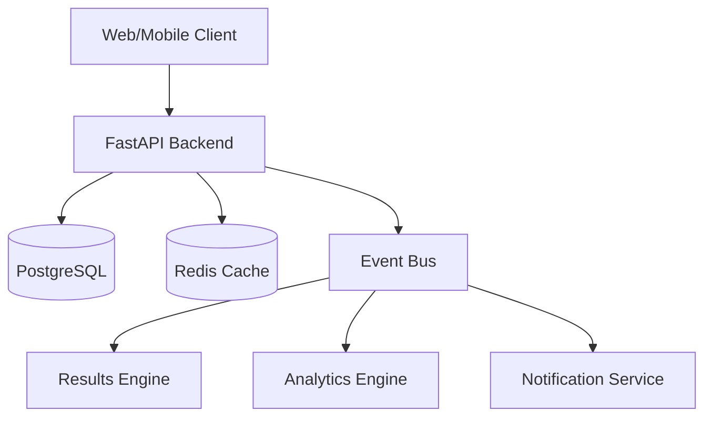
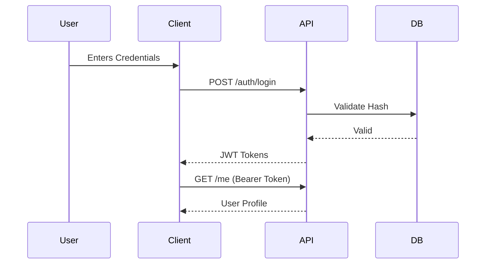
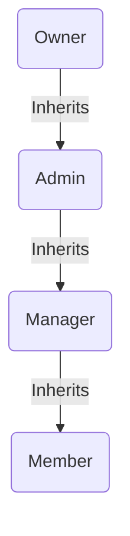
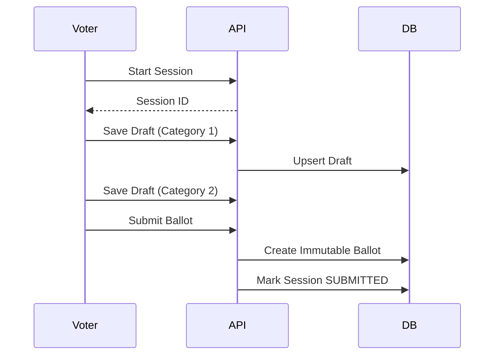
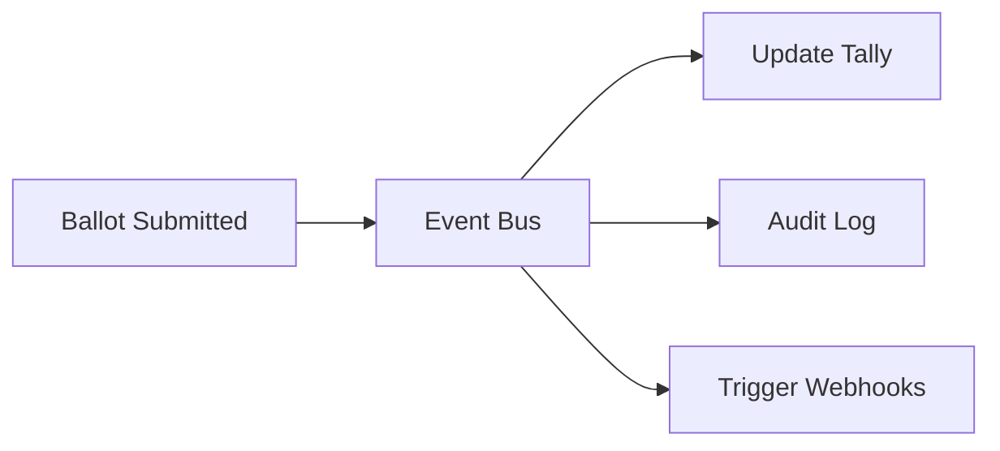

# OmniVote Development Bible v1.0

## System Architecture & Engineering Documentation

---

### OBJECTIVE
This document serves as the single source of truth for the entire OmniVote platform. It is a comprehensive engineering architecture document that explains how every major subsystem works, how they interact, and the principles behind the design decisions. It is written to production standards to allow new engineers to understand the platform without needing to parse the source code first. Maintainability, clarity, and long-term scalability are the utmost priorities.

---

## Chapter 1 — Platform Overview

### Vision and Goals
OmniVote is designed to be the ultimate, flexible, multi-tenant election and voting platform. Its goal is to handle everything from highly secured internal corporate elections to public paid awards and contests, all within a unified, scalable, and immutable architecture.

### Supported Voting Scenarios
- **Private Elections:** Restricted by specific domains, email lists, or pre-registered voters.
- **Public Polls:** Open to the public, tracked via visitor sessions (cookies/fingerprinting).
- **Paid Awards/Contests:** Direct voting for candidates combined with a secure payment gateway for vote allocation.

### High-Level Architecture
OmniVote follows a modern decoupled architecture:
- **Frontend:** React (Vite) + Tailwind CSS + React Query for state management.
- **Backend:** FastAPI (Python) running a RESTful JSON API.
- **Database:** PostgreSQL (Relational integrity) + Redis (Caching & Job Queues).
- **Event Bus:** Asynchronous internal event-driven architecture using background tasks for decoupled processing (e.g., tallying votes after ballot submission).

### Guiding Engineering Principles
1. **Multi-Tenant Philosophy:** Every major entity belongs to an `Organization`. Strict boundaries prevent cross-org data leakage.
2. **Immutability:** Once a ballot is cast, it can never be altered. This ensures absolute auditability and trust.
3. **Event-Driven:** Critical side-effects (analytics, results aggregation, emails) are processed asynchronously via domain events to keep the core API fast and resilient.

---

## Chapter 2 — Identity Platform

### Architecture
Identity is managed centrally. Users authenticate against the platform and can belong to multiple Organizations with different roles in each.

- **Registration & Login:** JWT-based authentication. Passwords are securely hashed using bcrypt.
- **Sessions:** Stateless JWT access tokens (short-lived) and secure HttpOnly refresh tokens (long-lived).
- **Authentication Lifecycle:** 
  1. User submits credentials.
  2. Backend issues Access & Refresh tokens.
  3. Client attaches Access token as Bearer token to API requests.

---

## Chapter 3 — RBAC (Role-Based Access Control)

### Role Hierarchy
OmniVote implements a two-tiered RBAC system:
1. **Platform Roles:** `SUPER_ADMIN` (Global access).
2. **Organization Roles:** `OWNER`, `ADMIN`, `MANAGER`, `MEMBER`.

### Inheritance & Evaluation
Permissions flow downwards. An `OWNER` inherits all `ADMIN` permissions. A user's effective permission is dynamically evaluated per-request by middleware that checks their JWT against the requested resource's `organization_id`.

---

## Chapter 4 — Organization Management

### Architecture
The `Organization` is the root aggregate for all data.
- **Memberships:** Links Users to Organizations with a specific Role.
- **Branding:** Custom logos, colors, and domains are scoped to the organization.
- **Impersonation Safeguards:** Super Admins can impersonate users for support, but this is strictly audit-logged and clearly flagged in the JWT claims to prevent abuse.

---

## Chapter 5 — Election Engine

### Lifecycle and States
Elections are the core containers of the platform.
- **States:** `DRAFT` ➔ `SCHEDULED` ➔ `ACTIVE` ➔ `CLOSED` ➔ `ARCHIVED`.
- **Validation:** An election cannot move to `ACTIVE` unless it has at least one category and candidate.
- **Why Elections are the Foundation:** All voting, payment, and category rules are scoped to the Election. This ensures predictable boundaries for billing, configuration, and results isolation.

---

## Chapter 6 — Category Engine

### Architecture
Categories define the positions (e.g., "President", "Best Actor").
- **Configuration:** Defines `max_winners` (e.g., vote for up to 3 people).
- **Ordering:** Supports manual reordering for ballot rendering.
- **Validation:** Ensures a voter doesn't select more candidates than permitted per category.

---

## Chapter 7 — Candidate Engine

### Architecture
Candidates belong to Categories.
- **Candidate Profiles:** Stores `full_name`, `bio`, `manifesto`, and `photo` URLs.
- **Soft Deletes:** Candidates are never hard-deleted once an election is active, preventing orphaned votes and maintaining audit trails.
- **Numbering:** Auto-incrementing or custom `candidate_number` for quick reference (e.g., "Text 4 to Vote").

---

## Chapter 8 — Voting Session Architecture

### Voting Flow
Voting is stateful to prevent data loss during long ballots.
1. **Session Creation:** When a voter opens the link, a `VotingSession` is created (tied to their user ID or a secure HttpOnly visitor cookie).
2. **Draft Saves:** As voters progress through the wizard, selections are `PATCH`ed to the draft.
3. **Review Screen:** Consolidates all draft selections for final confirmation.
4. **Submission Flow:** Moves the session to `SUBMITTED`, transforming draft selections into immutable `Ballot` records.

---

## Chapter 9 — Ballot Architecture

### Immutability
**Ballots never change after submission.** 
- **Schema Versioning:** Ballots store a snapshot of the candidate/category IDs at the time of voting.
- **Privacy Guarantees:** Ballots can be cryptographically unlinked from the Voter ID depending on the election's anonymity configuration, retaining only the proof of eligibility.

---

## Chapter 10 — Vote Processing Engine

### Validation Pipeline
1. Check Election status (`ACTIVE`).
2. Check Voter eligibility (Double-voting prevention via Session/Wallet status).
3. Validate selections against Category constraints (e.g., `max_winners`).
4. Execute DB transaction: Insert Ballot ➔ Update Session ➔ Dispatch `BallotSubmitted` event.

### Security
Transactions guarantee atomic commits. Row-level locks prevent race conditions where a user might try to submit twice simultaneously.

---

## Chapter 11 — Results Engine

### Counting Architecture
Results are completely decoupled from the transactional voting path to ensure high throughput.
- **Voting Calculators:** Event listeners consume `BallotSubmitted` events and incrementally update Redis counters.
- **Tie Handling:** Defined by election configuration (e.g., timestamp of first vote).
- **Caching:** Public results hit Redis, never the primary Postgres DB, ensuring the platform survives extreme traffic spikes (e.g., live TV award shows).

---

## Chapter 12 — Event-Driven Architecture

### Design
OmniVote relies heavily on an internal event bus for loose coupling.
- **BallotSubmitted:** The core event. 
- **Subscribers:** 
  - `ResultsHandler`: Updates the live tally.
  - `AuditHandler`: Writes to the immutable audit log.
  - `AnalyticsHandler`: Updates voting demographics.

---

## Chapter 13 — Payment Architecture

### Architecture
**Why Payments and Votes are separated:** To prevent financial regulations and payment gateway downtimes from affecting the core election integrity.
- **Vote Wallet:** Voters purchase "Vote Credits". A transaction is recorded.
- **Vote Processing:** Credits are deducted when the ballot is cast. 
- **Idempotency:** Payment webhooks use idempotency keys to prevent double-crediting.

---

## Chapter 14 — Public Voting

### UX Flows
- **Visitor Sessions:** For unauthenticated public voting (VerificationMethod = `NONE`), the backend generates a secure visitor session and issues a `HttpOnly` cookie. This serves as the identity, preventing casual duplicate voting without forcing a hard login wall.
- **Shareable Links:** Deep links to specific candidate pages for easy social media sharing.

---

## Chapter 15 — Security Architecture

### Threat Mitigation
- **Replay Protection:** Nonces and idempotency keys on payment and ballot submission.
- **Rate Limiting:** IP-based and User-based rate limiting on sensitive endpoints (Login, Submit).
- **OWASP:** Strict CORS, HttpOnly cookies, parameterized SQL queries (via SQLAlchemy), and HTML sanitization on candidate bios.

---

## Chapter 16 — Data Architecture

### Database Design
- **PostgreSQL:** Primary source of truth.
- **Redis:** Transient state (rate limiting, caching live results, background job queues).
- **Audit Storage:** Append-only tables for tracking `who` changed `what` and `when`.

---

## Chapter 17 — API Architecture

### Standards
- **REST Conventions:** Nouns for resources (e.g., `/elections/{id}/categories`).
- **Pagination:** Cursor-based or limit/offset for collections.
- **Response Standards:** Unified wrapper `{ "data": ..., "meta": ... }`.
- **Error Handling:** Standardized error shapes `{ "success": false, "message": "...", "error": { "code": "..." } }`.

---

## Chapter 18 — Frontend Architecture

### React Architecture
- **State Management:** `React Query` for server state (caching, deduplication). `Zustand` for global client UI state.
- **Forms:** `React Hook Form` + `Zod` for schema validation.
- **Component Reuse:** Atomic design principles using a unified UI library (Tailwind + Radix/Headless).
- **Error Boundaries:** Graceful degradation if a module fails, preventing the whole app from crashing.

---

## Chapter 19 — Deployment Architecture

### Infrastructure (Kubernetes-Ready)
OmniVote is containerized via Docker, making it orchestration-agnostic.
- **Reverse Proxy:** Nginx / Traefik handling SSL termination.
- **Background Workers:** Dedicated Python workers consuming from Redis.
- **Object Storage:** S3-compatible storage for candidate photos and organization logos.

---

## Chapter 20 — Scalability Strategy

### Growth Path
- **100 Users:** Single monolith container + local Postgres.
- **1,000 Users:** Separate DB and API containers. Add Redis.
- **10,000 Users:** Load-balanced API containers. Managed Postgres (RDS).
- **100,000+ Users:** Read-replicas for Postgres. Dedicated Redis cluster for results. Separate worker nodes for event processing.

---

## Chapter 21 — Engineering Standards

### Coding Standards
- **Python:** Black formatting, MyPy strict typing, Ruff linting.
- **TypeScript:** ESLint, strict mode, Prettier.
- **Migrations:** Alembic for DB changes. Never mutate existing migrations.
- **Branching Strategy:** Trunk-based development with short-lived feature branches and strict PR reviews.

---

## Chapter 22 — Future Roadmap

### Planned
- **Communication Engine:** SMS/Email blasts for voter engagement.
- **Multi-Language Support:** i18n for global deployments.

### Research
- **Blockchain Verification:** Providing voters with a cryptographic receipt to verify their vote independently.
- **AI Analytics:** Predictive voter turnout models.

### Long-Term Vision
- **Mobile Applications:** React Native wrappers for iOS/Android.
- **White-Label Deployments:** Turn-key isolated instances for government entities.

---

*End of Document*
