# OmniVote Development Bible v1.1

## System Architecture & Engineering Documentation

---

### OBJECTIVE
This document serves as the canonical engineering reference and single source of truth for the entire OmniVote platform. It explains the domain model, architectural boundaries, subsystem interactions, and the principles driving the engineering design. It is written to production standards to allow engineers to grasp the system conceptually without reading the source code first. Maintainability, consistency, and long-term scalability are the utmost priorities.

---

## Chapter 1 — Platform Overview

### Vision and Goals
OmniVote is the ultimate, highly flexible, multi-tenant election and voting platform. Its goal is to gracefully handle everything from strict internal corporate governance elections to mass-market public paid awards and contests, all within a unified, scalable, and immutable architecture.

### Supported Voting Scenarios
- **Private Elections:** Restricted to specific domains, verified emails, or pre-registered voter registries.
- **Public Polls:** Open to the public, tracked via secure visitor sessions.
- **Paid Awards/Contests:** Direct voting for candidates coupled with a secure payment gateway for credit allocation.

### High-Level Architecture
OmniVote utilizes a decoupled, event-driven architecture:
- **Frontend:** React (Vite) + Tailwind CSS + React Query.
- **Backend:** FastAPI (Python) exposing a RESTful JSON API.
- **Database:** PostgreSQL (Relational integrity) + Redis (Caching & Job Queues).
- **Event Bus:** Asynchronous internal domain events trigger side-effects like vote tallying and audit logging.

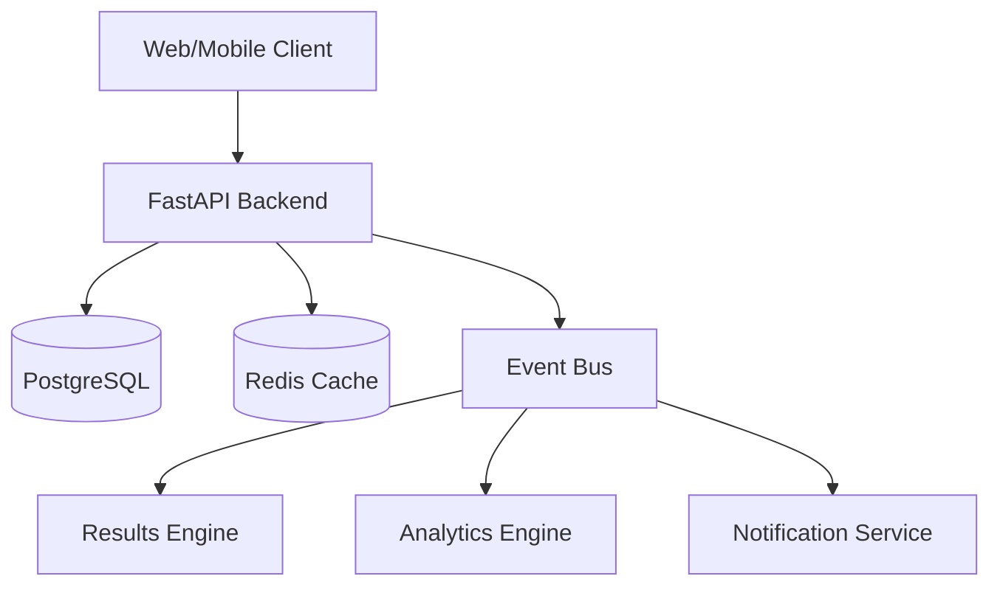

---

## Chapter 2 — Domain Model

OmniVote's domain model defines the hierarchical ownership and relationships across the platform.

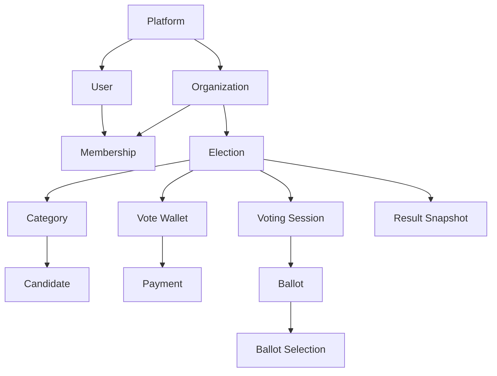

### Aggregate Ownership & Lifecycle
- **Organizations** own Elections and Memberships. When an organization is deleted, its downstream entities are either soft-deleted or archived.
- **Elections** own Categories, Vote Wallets, and Voting Sessions. 
- **Categories** own Candidates.
- **Voting Sessions** yield a single immutable **Ballot** upon submission.
- **Vote Wallets** own Payments. Wallets are event-specific to prevent cross-election balance bleed.

---

## Chapter 3 — Aggregate Boundaries

Domain-Driven Design (DDD) principles enforce transactional boundaries and aggregate roots to ensure data consistency.

### 1. Organization Aggregate
- **Root:** `Organization`
- **Children:** `OrganizationMembership`, `OrganizationSettings`
- **Boundary:** Handles tenant isolation and billing identity.

### 2. Election Aggregate
- **Root:** `Election`
- **Children:** `ElectionSettings`
- **Boundary:** The primary configuration unit. It determines whether the event is an award, poll, or strict election.

### 3. Category & Candidate Aggregate
- **Root:** `Category`
- **Children:** `Candidate`
- **Boundary:** Categories define the positions. Candidates are intrinsically tied to Categories. Reordering and constraints (`max_winners`) are enforced here.

### 4. Voting Session Aggregate
- **Root:** `VotingSession`
- **Children:** `VotingSelection` (Drafts)
- **Boundary:** Manages the transient state of a voter navigating the ballot.

### 5. Ballot Aggregate
- **Root:** `Ballot`
- **Children:** `BallotSelection`
- **Boundary:** Immutable record of a finalized vote. Once created, it is sealed.

### 6. Vote Wallet & Payment Aggregate
- **Root:** `VoteWallet`
- **Children:** `Payment`, `VoteTransaction`
- **Boundary:** Manages financial ledgers. Completely decoupled from the Voting Session aggregate to isolate financial failures from voting logic.

---

## Chapter 4 — Database Philosophy

OmniVote's storage layer is optimized for high integrity and high throughput.

### Technology Stack
- **PostgreSQL:** The absolute source of truth. Chosen for strict ACID compliance, powerful JSONB indexing, and robust relational constraints.
- **Redis:** Used for ephemeral state, distributed locking, rate-limiting, and caching the highly-concurrent live results.
- **SQLAlchemy 2.0 (Async):** Provides the ORM layer, leveraging modern async Python to maximize concurrent request throughput.
- **Alembic:** Strictly manages database migrations. Migrations are immutable once deployed.

### Engineering Decisions
- **UUID Primary Keys:** Used universally (UUIDv7 preferred for sortability) to prevent ID enumeration attacks and simplify distributed data generation.
- **Soft Deletes:** Records like Candidates or Elections are soft-deleted via a `deleted_at` timestamp. This preserves the integrity of historical ballots and audit logs.
- **Immutable Records:** Ballots and Audit Logs are append-only. They are never updated or hard-deleted.
- **Optimistic Locking:** Applied to financial transactions (Vote Wallets) using version columns to prevent race conditions during rapid concurrent voting.

---

## Chapter 5 — Multi-Tenant Architecture

OmniVote is a strict multi-tenant platform. Tenant isolation is enforced at the software layer.

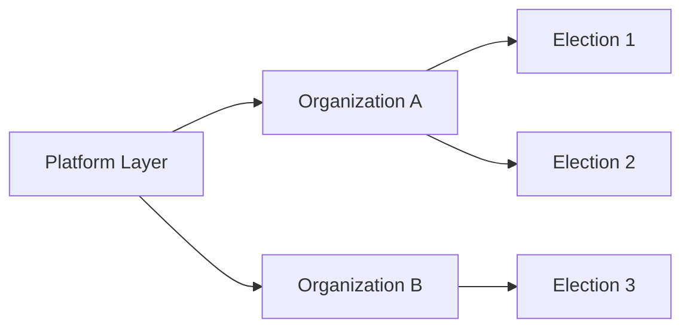

### Data Ownership & Isolation
Every domain entity explicitly maps back to an `organization_id` (either directly or via its aggregate root).
- **Authorization Boundaries:** API middleware inherently filters all database queries by the `organization_id` extracted from the routing context. A user cannot query an election belonging to an organization they do not have access to.
- **Future White-Label Support:** Strict tenant isolation paves the way for Custom Domains and entirely white-labeled instances (e.g., `vote.company.com`) resolving directly to an Organization context.

---

## Chapter 6 — Lifecycle State Machines

OmniVote orchestrates complex business processes through strict state machines.

### Election Lifecycle
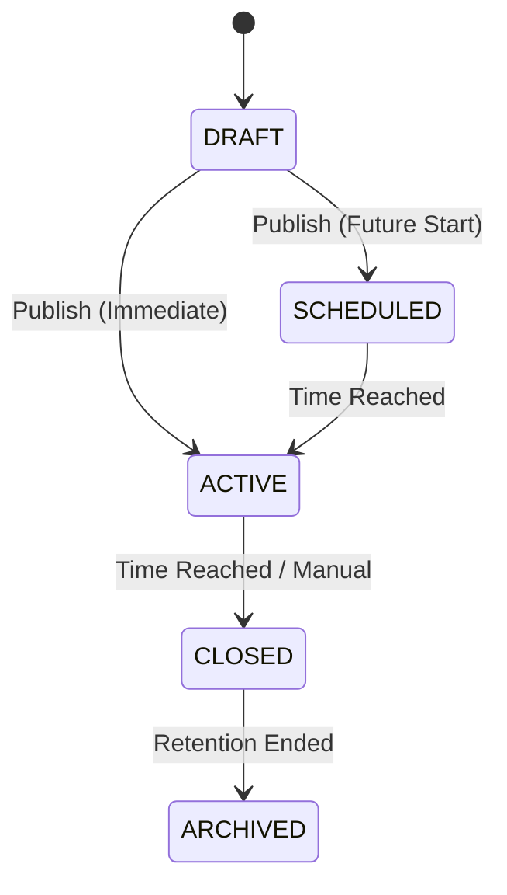

### Voting Session Lifecycle
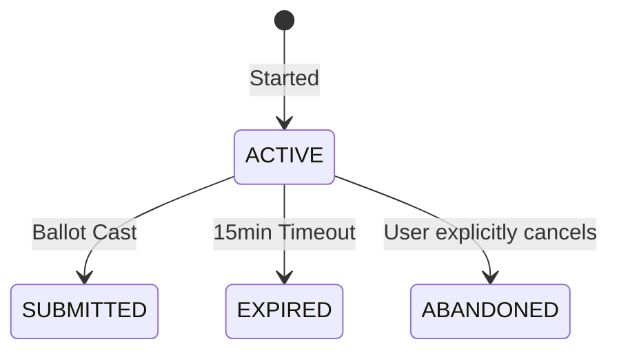

### Payment Lifecycle
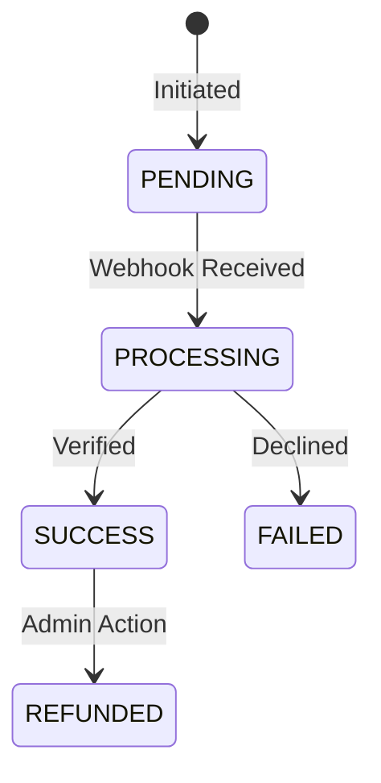

### Ballot Lifecycle
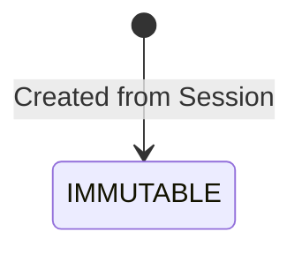

### Visitor Session Lifecycle
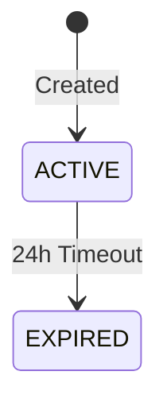

### Vote Wallet Lifecycle
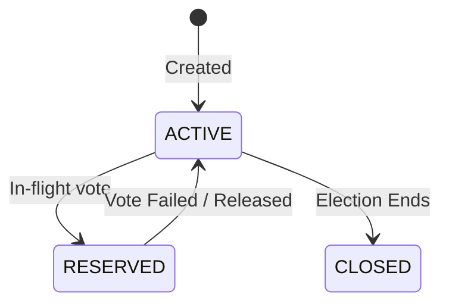

---

## Chapter 7 — Configuration Philosophy

OmniVote operates on a **Configuration-First Architecture**. Instead of building separate codebases or divergent endpoints for an "Award Show" versus a "Corporate Board Election", the core `Election Engine` adapts based on settings.

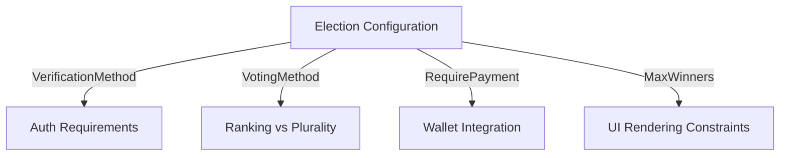

**Adaptability:**
- **General Elections:** `VerificationMethod.EMAIL`, Single-winner plurality.
- **Paid Awards:** `VerificationMethod.NONE`, `RequirePayment=True`.
- **Public Polls:** `VerificationMethod.NONE`, single-category.

---

## Chapter 8 — Voting Experience

To support various configurations, the frontend orchestrates two primary voting UX flows.

### A. Session Wizard
Used for multi-category elections and formal ballots.
1. **Welcome & Verification:** Authenticates user or provisions Visitor Session.
2. **Category Navigation (Wizard):** Paginates through categories.
3. **Draft Saves:** Implicitly patches the session draft upon clicking 'Next'.
4. **Save & Exit / Recovery:** Allows voters to leave and resume their session later.
5. **Review Screen:** Consolidates all selections.
6. **Payment (Optional):** Checks out if required.
7. **Submit & Success:** Finalizes the immutable ballot.

### B. Direct Candidate Voting
Used for fast, single-candidate actions (Awards, Contests).
1. **Candidate Page:** Voter views a specific candidate's public profile.
2. **Vote Action:** Voter clicks "Vote".
3. **Choose Amount:** Selects number of votes (if paid).
4. **Payment & Verification:** Fast-tracks checkout.
5. **Vote Allocation & Success:** Ballot is cast instantly without a review screen.

---

## Chapter 9 — Identity Platform & Visitor Sessions

### User Identity
- **Registration & Login:** JWT-based stateless authentication. Passwords hashed with bcrypt.
- **Sessions:** Short-lived Access Tokens (Bearer) + long-lived Refresh Tokens (HttpOnly).

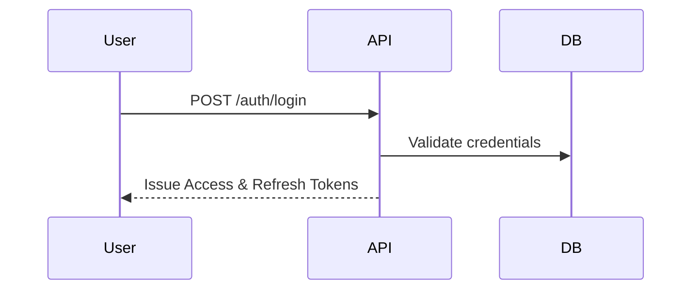

### Visitor Session Architecture
For public voting (`VerificationMethod.NONE`), forcing user registration causes immense friction.
- **Architecture:** The backend generates a secure `VisitorSession` record and issues an encrypted, `HttpOnly` cookie containing a `visitor_token`.
- **Identity:** This token acts as a pseudo-identity. It links to Rate Limiting, Fraud Detection (IP/User-Agent hashing), Draft Sessions, and Vote Wallets.
- **Why over Local Storage:** Local storage is easily cleared by users to bypass limits. HttpOnly cookies enforce stronger server-side control and prevent XSS exfiltration.

---

## Chapter 10 — RBAC (Role-Based Access Control)

### Role Hierarchy
1. **Platform Roles:** `SUPER_ADMIN` (Global override).
2. **Organization Roles:** `OWNER` > `ADMIN` > `MANAGER` > `MEMBER`.

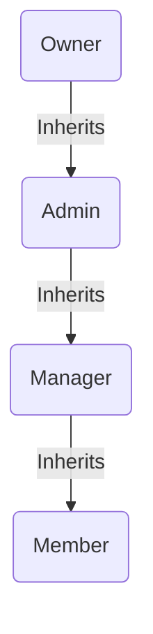

Permissions are evaluated dynamically per-request. Middleware cross-references the requested Organization ID with the user's JWT claims.

---

## Chapter 11 — Organization Management

Organizations encapsulate Branding, Settings, and Users. Support access requests require explicit temporary grants, and Super Admin impersonations are strictly flagged in audit logs and JWT claims to prevent covert abuse.

---

## Chapter 12 — Election, Category, and Candidate Engines

### Election Engine
The nucleus of the platform. Holds temporal state (start/end dates) and orchestrates all voting traffic.

### Category Engine
Defines constraints. A single election can have dozens of categories. Ordering mechanisms allow organizers to structure the ballot logically.

### Candidate Engine
Profiles contain photos, bios, and numbering. Candidates belong strictly to Categories. Soft deletion ensures active ballots referencing a removed candidate do not crash the results tally.

---

## Chapter 13 — Voting Session & Ballot Architecture

### Sessions
Sessions are transient. They track drafts and enforce the 15-minute inactivity timeout to prevent hanging locks.

### Ballots
**Ballots are strictly immutable.**
- Once `VotingSession` transitions to `SUBMITTED`, an atomic transaction converts the draft into a `Ballot`.
- The ballot stores a historical snapshot of the IDs. It never mutates, ensuring cryptographic auditability.

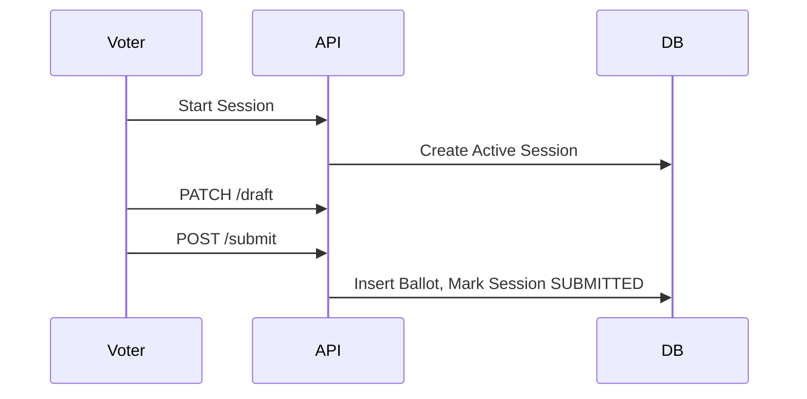

---

## Chapter 14 — Payment & Wallet Architecture

**Separation of Concerns:** Payments and Voting are strictly separated business domains to prevent financial provider outages from halting the voting engine.

### Architecture
- **Vote Wallet:** Event-specific ledgers. A voter buys "Credits" for Election A; those credits cannot be spent in Election B.
- **Payment Lifecycle:** Providers (e.g., Stripe, Paystack) trigger webhooks. Webhooks are secured via idempotency keys to prevent double-funding.
- **Reservation:** When a ballot is submitted, credits are *reserved*, the vote is cast, and credits are *consumed*. If the vote fails, credits are released.

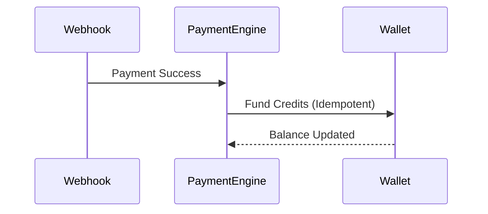

---

## Chapter 15 — Vote Processing & Results Engine

### Vote Processing
The submission pipeline utilizes database row-level locking to prevent duplicate submissions. Upon success, it dispatches a `BallotSubmitted` domain event.

### Results Engine
Results are purely eventually consistent.
- **Event Listeners** consume `BallotSubmitted` and increment Redis counters.
- **Caching:** Public dashboards read strictly from Redis snapshots, shielding PostgreSQL from high-read traffic during live events.

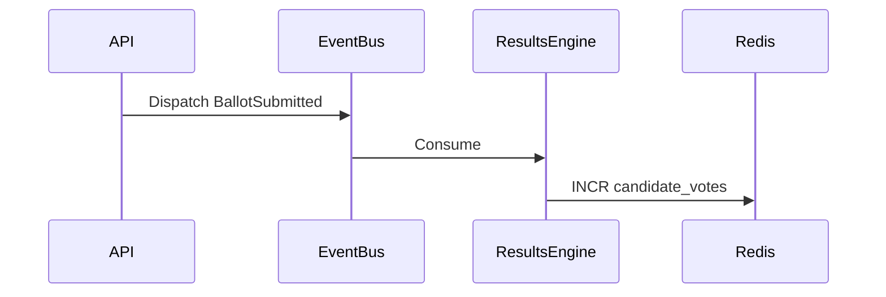

---

## Chapter 16 — Event-Driven Architecture

OmniVote utilizes internal domain events for extreme loose coupling.
- **Events:** `BallotSubmitted`, `ElectionClosed`, `PaymentVerified`.
- **Subscribers:** Results tallying, Audit logging, Notification dispatch.

---

## Chapter 17 — Plugin Architecture

OmniVote's core is isolated from third-party volatility via Adapters and Ports.

### Extension Points
- **Payment Providers:** Adapters for Stripe, Paystack, Flutterwave.
- **Notifications:** Adapters for SendGrid, Twilio (SMS).
- **Identity:** OAuth Providers (Google, Microsoft).
- **Analytics:** Export plugins for external BI tools.

---

## Chapter 18 — Security Architecture

- **Encryption & Secrets:** `.env` injection. bcrypt for passwords.
- **Fraud Prevention:** Rate limiting, Visitor fingerprinting, Idempotency keys.
- **Audit Logs:** Immutable `audit_event` tables tracking sensitive actions.

---

## Chapter 19 — API & Frontend Architecture

### API
- REST conventions (`/organizations/{id}/elections`).
- Unified response envelopes (`data`, `meta`).

### Frontend
- **React + Vite:** Component-driven development.
- **React Query:** Manages all server state and caching.
- **Tailwind CSS:** Atomic styling.

---

## Chapter 20 — Deployment & Scalability Strategy

OmniVote is orchestrator-agnostic (Docker/K8s ready).

### Scalability Growth Path
1. **1k Users:** Monolith + local Postgres + Redis.
2. **10k Users:** Load-balanced API containers. Managed RDS.
3. **100k+ Users:** Dedicated Event Worker nodes, read-replicas for Postgres, Redis Cluster for caching spikes.

---

## Chapter 21 — Engineering Standards

### Naming Conventions
- **Database Tables:** `snake_case`, singular (e.g., `voting_session`).
- **Enums:** `PascalCase` classes, `UPPERCASE` values.
- **Services/Repos:** `ServiceName`, `RepositoryName`.
- **Frontend Hooks:** `useFeatureName` (e.g., `useElections`).

### Practices
- **Migrations:** Alembic. Never mutate existing migrations.
- **Branching:** Trunk-based development.

---

## Chapter 22 — Architecture Decision Records (ADR)

### ADR-001: Immutable Ballots
- **Decision:** Ballots are strictly insert-only.
- **Consequence:** Absolute auditability, but requires complex session draft management prior to submission.

### ADR-002: Categories instead of multiple Elections
- **Decision:** Elections group Categories, rather than treating Categories as individual elections.
- **Consequence:** Centralizes billing, settings, and visitor sessions.

### ADR-003: Unified Election Engine & ADR-009: Configuration-First
- **Decision:** Build one adaptable engine configured via settings rather than distinct apps for Polls vs Awards.
- **Consequence:** Higher initial complexity, massively reduced maintenance burden.

### ADR-004: Event-driven Results
- **Decision:** Results are calculated asynchronously via Redis.
- **Consequence:** Ensures the submission API never bottlenecks on complex tallying queries.

### ADR-005 & ADR-006: Payments separated from Voting (Vote Wallets)
- **Decision:** Decouple payments into a Wallet model.
- **Consequence:** Vote integrity is isolated from Stripe/Gateway timeouts.

### ADR-007: Visitor Sessions
- **Decision:** Use HttpOnly cookies over local storage for public voters.
- **Consequence:** Stronger fraud prevention and cross-tab consistency.

### ADR-008: Event-specific Wallets
- **Decision:** Wallets do not span across elections.
- **Consequence:** Simplifies accounting, refunds, and prevents cross-event balance bleed.

### ADR-010: Two Voting UX Flows
- **Decision:** Separate Wizard vs Direct UX paths natively.
- **Consequence:** Optimizes conversion rates for paid awards while maintaining rigor for formal elections.

---

## Chapter 23 — Ecosystem Vision (VeroSeven)

OmniVote is positioned within the broader **VeroSeven Ecosystem**, integrating seamlessly with sibling platforms:
- **NEXRA / Seven AI:** Leveraging predictive analytics and anti-fraud heuristics.
- **EduNexa:** Powering student union and institutional elections.
- **Lost & Found Network:** Shared identity and notification infrastructure.

---

## Chapter 24 — Future Evolution

### Phase I — Core Platform (Completed)
- Multi-tenant engine, RBAC, Core Voting & Results, Payments.

### Phase II — Platform Experience
- Real-time Engine (WebSockets for live dashboards).
- Communication Engine (SMS/Email blasts).
- USSD Engine (Voting via feature phones).

### Phase III — Enterprise Platform
- Full white-labeling, Custom SSO integrations.

### Phase IV & V — Intelligence & Global
- AI-driven fraud analytics, Global i18n, blockchain receipts (research).

---

## Chapter 25 — Glossary

- **Organization:** The root multi-tenant boundary.
- **Election:** The primary event container holding categories and settings.
- **Category:** A specific position or award title (e.g., "President").
- **Candidate:** An entity running in a category.
- **Voting Session:** A transient state tracking a user's progress before submission.
- **Ballot:** The immutable, finalized record of a vote.
- **Vote Wallet:** A ledger holding purchased Vote Credits for a specific election.
- **Visitor Session:** A secure cookie-based identity for unauthenticated public voting.
- **Domain Event:** An asynchronous system trigger (e.g., `BallotSubmitted`).

---
*End of Document*
