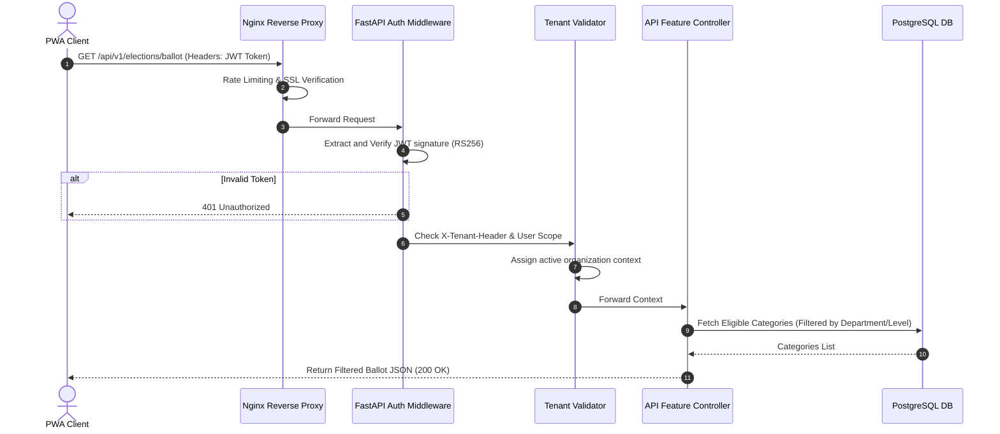
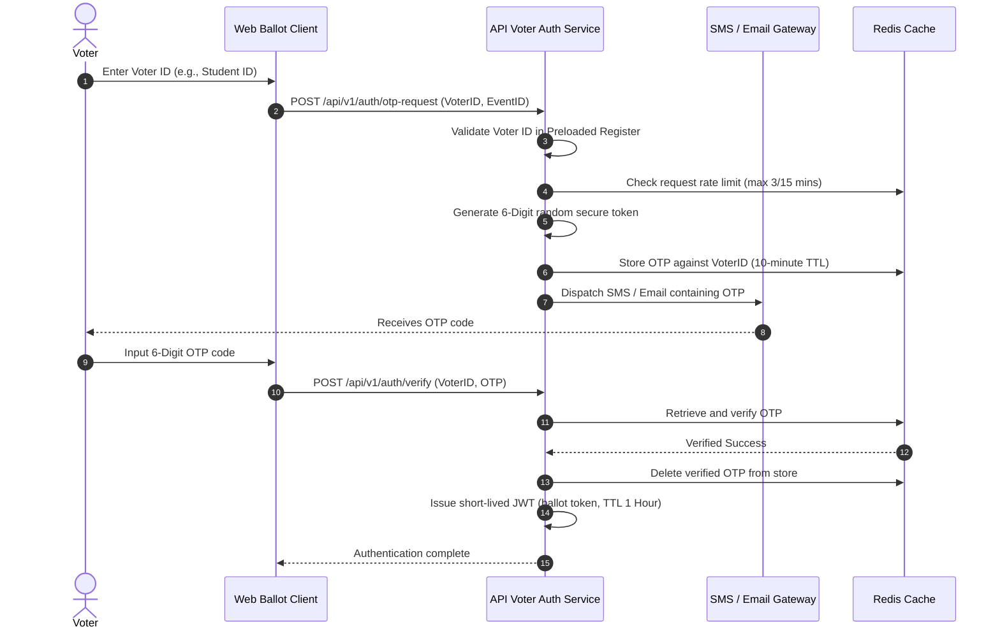
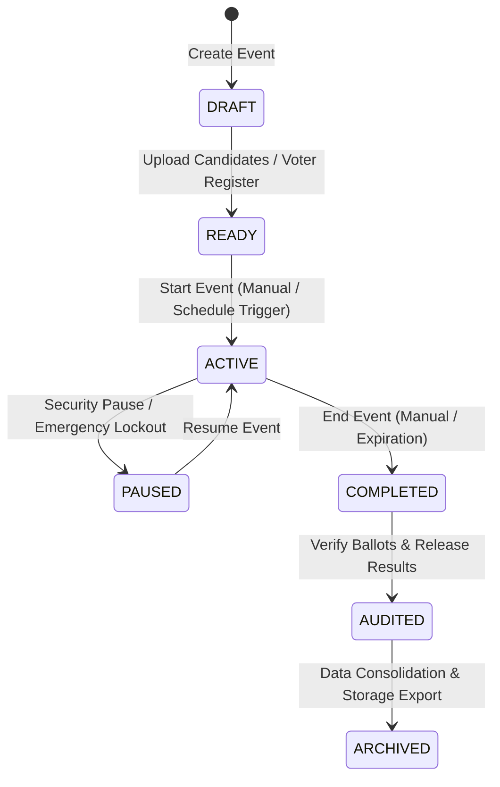
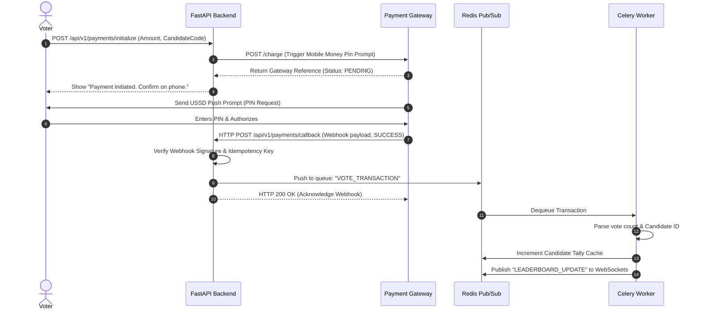
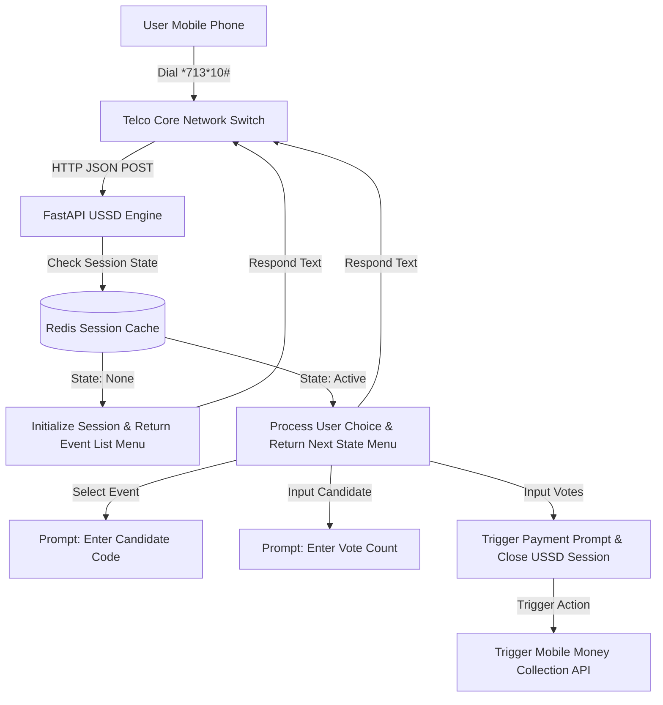
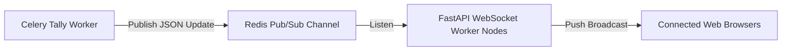

# OmniVote — System Architecture Design v1.0
**One System. Every Vote.**
*Powered by VeroSeven*

---

## 1. Overall System Architecture
OmniVote is built upon a multi-tenant, cloud-native, and horizontally scalable architecture pattern. The system decouples interactive client layers, asynchronous backend endpoints, job queues, and datastores.

The architecture relies on the following design foundations:
* **Database Multitenancy:** Shared database with tenant isolation using a tenant-key (`organization_id`) strategy on all tables. Separate database schemas or logical databases can be configured for enterprise clients.
* **Separation of Read/Write Paths (CQRS-lite):** High-volume write transactions (paid votes, bulk voter ingestion) bypass synchronous PostgreSQL writes using memory-buffered Redis queues, processed asynchronously via Celery workers. Read telemetry queries utilize Redis caching and PostgreSQL read replicas.
* **Decoupled Client Interfaces:** A Progressive Web App (PWA) client interacts via REST APIs and WebSockets. The USSD service interacts through Telco USSD Gateways converting basic cellular menu inputs into HTTP REST API requests.

---

## 2. High-Level Architecture Diagram
The diagram below illustrates the components of the OmniVote platform and their primary interactions:

```mermaid
graph TB
    subgraph Client Layer
        WebUser[React Vite PWA client]
        USSDUser[Mobile Phone - USSD Dialing]
        APIUser[Third-Party Integrations / Mobile Apps]
    end

    subgraph Edge Layer
        NginxGateway[Nginx Reverse Proxy & Load Balancer]
        USSDGateway[Telco USSD Integration Gateway]
    end

    subgraph Application Services
        FastAPI_Web[FastAPI Web/WebSocket API Instances]
        FastAPI_USSD[FastAPI USSD Session Handler]
    end

    subgraph Cache & Messaging
        RedisCache[(Redis Cache & Session Store)]
        CeleryBroker[Celery Message Broker - Redis]
    end

    subgraph Task Processing
        CeleryWorkers[Celery Asynchronous Workers]
    end

    subgraph Storage Layer
        PostgrePrimary[(PostgreSQL Primary Writer)]
        PostgreReplicas[(PostgreSQL Read Replicas)]
        MinIO[(MinIO / Supabase Object Storage)]
    end

    %% Client Connection Flows
    WebUser -->|HTTPS / WSS| NginxGateway
    APIUser -->|HTTPS| NginxGateway
    USSDUser -->|USSD Protocols| USSDGateway
    USSDGateway -->|HTTP JSON POST| NginxGateway

    %% Gateway Routing
    NginxGateway -->|Proxy Port 8000| FastAPI_Web
    NginxGateway -->|Proxy Port 8002| FastAPI_USSD

    %% Application Interactions
    FastAPI_Web -->|Read/Write Session| RedisCache
    FastAPI_Web -->|Read Telemetry| PostgreReplicas
    FastAPI_Web -->|Write Transactions| PostgrePrimary
    FastAPI_Web -->|Task Enqueue| CeleryBroker
    
    FastAPI_USSD -->|Read/Write State| RedisCache
    FastAPI_USSD -->|Read Codes| PostgreReplicas

    %% Background Job Executions
    CeleryBroker --> CeleryWorkers
    CeleryWorkers -->|Bulk Bulk Write| PostgreSQL Primary
    CeleryWorkers -->|Store Reports| MinIO
    CeleryWorkers -->|Push Webhook / SMS| ExternalAPIs[Telco SMS/Email/Payment Providers]
```

---

## 3. Frontend Architecture
The React frontend is constructed as a modern, type-safe Progressive Web App (PWA) leveraging Vite for compilation.

```
┌──────────────────────────────────────────────────────────┐
│                      React Router                        │
│                (Declarative SPA Routes)                  │
└────────────┬───────────────────────────────┬─────────────┘
             ▼                               ▼
┌──────────────────────────┐    ┌──────────────────────────┐
│      TanStack Query      │    │     React Hook Form      │
│  (Server State Caching)  │    │     (Zod Validation)     │
└────────────┬─────────────┘    └────────────┬─────────────┘
             ▼                               ▼
┌──────────────────────────────────────────────────────────┐
│                     ShadCN Component                     │
│               (Tailwind Styled UI Blocks)                │
└──────────────────────────────────────────────────────────┘
```

* **Client Routing:** `React Router` enforces path isolation:
  * `/auth/*`: Authentication flows (Login, Register, Password Reset)
  * `/dashboard/*`: Tenant Organization Administration (Organization Admins)
  * `/platform/*`: VeroSeven Platform Administration (Platform Staff)
  * `/vote/*`: Public Voting Interfaces
* **State Management:** Decoupled into:
  * **Server State:** Handled by `TanStack Query` (React Query) to query, cache, and synchronize backend database responses with configured TTLs.
  * **Local UI State:** React context/hooks for layout modes, modal toggles, and multi-step ballot state tracking.
* **Form & Validation:** `React Hook Form` integrated with `Zod` validation schemas ensuring type-safe inputs on client submission.
* **PWA & Offline Strategy:** Built using `vite-plugin-pwa` utilizing a custom Service Worker. Offline caching policies:
  * **NetworkFirst:** For active ballot metadata and dynamic event rules.
  * **CacheFirst:** For static images, CSS assets, and fonts.
  * **NetworkOnly:** For actual ballot submission endpoints.

---

## 4. Backend Architecture
The backend is an asynchronous Python 3.13 application leveraging FastAPI.

* **Concurrency Model:** All I/O operations (database queries, network requests, cache updates) utilize Python `asyncio`. Uvicorn acts as the ASGI server, and Gunicorn handles multi-process scaling.
* **Data Access Layer:** `SQLAlchemy 2.x` utilizing the async dialect (`asyncpg`) to manage PostgreSQL connections. Alembic manages declarative migration tracking.
* **Data Validation:** `Pydantic v2` models validate all API payloads at the boundary, ensuring incoming JSON maps precisely to python data structures.
* **Dependency Injection:** Built-in FastAPI dependency injection provides database session overrides, authentication checks, and tenant isolation middleware automatically during request parsing.

---

## 5. Module-Based Architecture
To ensure scalability and separation, the platform decouples the core logic of Module A (Standard Elections) from Module B (Paid/Event Voting).

```
                    ┌─────────────────────────┐
                    │      FastAPI App        │
                    └────────────┬────────────┘
                                 │
           ┌─────────────────────┴─────────────────────┐
           ▼                                           ▼
┌─────────────────────┐                     ┌─────────────────────┐
│      Module A       │                     │      Module B       │
│  Standard Election  │                     │  Paid/Event Voting  │
├─────────────────────┤                     ├─────────────────────┤
│ - OTP Validation    │                     │ - Payment Webhooks  │
│ - Eligibility checks│                     │ - Telco Aggregators │
│ - Decoupled Ballots │                     │ - USSD State Machine│
│ - Rigid 1-Vote rules│                     │ - Bulk Tally Buffers│
└─────────────────────┘                     └─────────────────────┘
```

* **Module A (Standard Elections):**
  * Focuses on identity, verification, and eligibility boundaries.
  * Incorporates voter registration models, OTP generation engines, and eligibility checks.
  * Strict ballot validation logic: Ballots must write to PostgreSQL instantly via a database transaction.
* **Module B (Paid/Event Voting):**
  * Focuses on transactional scale, external billing integrations, and USSD support.
  * Avoids transactional checks on voter databases; instead, processes payments first.
  * Uses write-buffering: successful transactions write to Redis queues, incrementing candidate scores in bulk.

---

## 6. Feature-Based Folder Organization

To adhere to clean architecture, a **Feature-First** structure is implemented for both frontend and backend.

### 6.1 Backend Folder Structure
```
backend/
├── app/
│   ├── main.py                    # App entrypoint
│   ├── config.py                  # Global application settings
│   ├── core/                      # Global singletons (db, redis, security)
│   │   ├── database.py
│   │   ├── redis.py
│   │   ├── celery.py
│   │   └── security.py
│   ├── features/                  # Feature modularity
│   │   ├── organizations/         # Organization logic
│   │   │   ├── models.py
│   │   │   ├── schemas.py
│   │   │   ├── crud.py
│   │   │   └── router.py
│   │   ├── events/
│   │   ├── elections/             # Module A Specific
│   │   ├── paid_voting/           # Module B Specific
│   │   └── ussd/                  # USSD Specific
│   └── tests/                     # Test Suites
```

### 6.2 Frontend Folder Structure
```
frontend/
├── public/
├── src/
│   ├── main.tsx
│   ├── App.tsx
│   ├── components/                # Shared UI design components (ShadCN)
│   │   └── ui/
│   ├── features/                  # Feature modularity
│   │   ├── auth/
│   │   │   ├── components/
│   │   │   ├── hooks/
│   │   │   └── services.ts
│   │   ├── organizations/
│   │   ├── elections/             # Module A Components
│   │   └── paid_voting/           # Module B Components
│   ├── hooks/                     # Shared custom hooks
│   ├── lib/                       # Third-party configurations (axios, queryClient)
│   └── routes/                    # Declarative Router mapping
```

---

## 7. Request Flow
Standard web requests undergo structural authentication, security screening, and routing steps:



---

## 8. Authentication Flow
OmniVote features decoupled authentication workflows depending on user roles.

### 8.1 Administrative Authentication
Admin accounts use standard credentials coupled with multi-factor authentication (MFA).
1. Admin submits email/password.
2. System verifies credentials using Argon2id.
3. System requests TOTP verification token.
4. Upon successful validation, the system issues an asymmetric signed JWT.

### 8.2 Voter Authentication (Module A)
Voters do not have persistent credentials. Instead, they authenticate on a per-event basis via an OTP flow:



---

## 9. Authorization (RBAC) Flow
Access control is implemented as a role hierarchy checked via FastAPI dependencies.

### 9.1 Role Matrix

| Role | Scope | Permissions |
| :--- | :--- | :--- |
| **SuperAdmin** | Global (All Tenants) | Manage organizations, configure global payment rates, access platform logs. |
| **OrgAdmin** | Organization Specific | Manage users, create events, view organization billing history. |
| **ElectionOfficer** | Event Specific | Upload voter registers, edit candidates, start/stop events. |
| **Auditor** | Read-Only Event Scope | View real-time audit logs, download turnout reports, verify ballots. |

### 9.2 Execution Mechanism
Checks are enforced using FastAPI endpoints dependencies:
```python
# Authorization Check Dependency Example
def require_permission(required_role: str):
    async def dependency(current_user: User = Depends(get_current_user)):
        if ROLE_HIERARCHY[current_user.role] < ROLE_HIERARCHY[required_role]:
            raise HTTPException(status_code=403, detail="Insufficient permissions")
        return current_user
    return dependency
```

---

## 10. Event Lifecycle
Events progress through distinct operational states. Transitions between states require verification and trigger background jobs.



* **DRAFT:** Initial setup state. Candidates and eligibility categories can be dynamically added.
* **READY:** Configurations are locked. For Module A, voter lists are parsed and cached.
* **ACTIVE:** Voting is open. Real-time dashboards process incoming transactions.
* **PAUSED:** Temporarily suspends incoming vote processing (e.g., if a system breach is suspected).
* **COMPLETED:** Voting window is closed. No new votes can be submitted.
* **AUDITED:** Cryptographic checks verify the vote counts against active voters.
* **ARCHIVED:** Active records are converted into compressed database objects; reports are written to MinIO.

---

## 11. Voting Lifecycle
The system handles vote processing based on the event module type.

### 11.1 Module A (Standard Elections) Voting Lifecycle
```
[Voter Authenticates] ──> [Filters Eligible Categories] ──> [Fills Ballot Selection]
                                                                  │
┌─────────────────────────────────────────────────────────────────┘
▼
[Submit Ballot (Transactional Endpoint)]
  ├── 1. Verify Ballot Token is valid
  ├── 2. Verify has_voted = False (Select For Update row lock)
  ├── 3. Set has_voted = True (PostgreSQL)
  ├── 4. Insert decoupled Ballot selections to Ballot Table (PostgreSQL)
  └── 5. Commit database Transaction & push dynamic updates to WebSocket connection
```

### 11.2 Module B (Paid Voting) Voting Lifecycle
```
[Public Voter Selects Candidate] ──> [Enters Count & Number] ──> [Initialize Payment]
                                                                        │
┌───────────────────────────────────────────────────────────────────────┘
▼
[Await Telco Callback (Webhook)]
  ├── Receive Payment Success notification
  ├── Enqueue Transaction payload into Redis Queue
  └── Async Celery Worker:
        ├── Increments candidate score in Redis Cache
        ├── Appends transaction metadata to PostgreSQL DB
        └── Pushes score updates to public leaderboard channel
```

---

## 12. Payment Lifecycle (Module B)
Paid voting requires highly resilient payment integrations using an asynchronous webhook workflow.



---

## 13. USSD Lifecycle
Telco USSD requests are handled by basic stateless servers responding within a 1-second timeframe.



---

## 14. Notification Flow
System notifications (ballot confirmations, OTP alerts, system messages) are processed through asynchronous background workers:

```
[System Event Occurs (e.g., OTP Request)]
  └── Enqueue message to Celery Queue: "notifications"
        └── Celery Worker extracts task:
              ├── 1. Look up user notification preferences
              ├── 2. Map template variables to HTML/Text layouts
              ├── 3. Contact provider API (Twilio, SendGrid, Telco API)
              └── 4. Write delivery status and message log to Database
```

---

## 15. Audit Logging Flow
Security auditing maintains an immutable timeline of administrative activities.

```
[Admin Component Action (e.g., Change Candidate Name)]
  └── Controller interceptor copies metadata:
        ├── Actor ID (Admin User)
        ├── Action Target & Action Type (UPDATE_CANDIDATE)
        ├── Timestamp (UTC)
        ├── Originating IP & User Agent
        └── JSON payload containing diff (Before / After states)
  └── Writes to system audit log via an isolated thread/Celery task.
```

---

## 16. Real-Time Update Flow
Real-time dashboard leaderboards are pushed using WebSockets.



* **Client Subscription:** When clients open `/leaderboard/:eventId`, they establish a WebSocket connection: `wss://omnivote.com/ws/leaderboard/:eventId`.
* **State Syncing:** On connection, the client receives the cached leaderboard score from Redis. Future changes are pushed dynamically via Redis Pub/Sub events.

---

## 17. Database Interaction Flow
To prevent database contention and deadlock conditions during high-volume events:

```
                  ┌───────────────────────────────┐
                  │      Read / Write Query       │
                  └───────────────┬───────────────┘
                                  │
           ┌──────────────────────┴──────────────────────┐
           ▼                                             ▼
┌───────────────────────────────┐             ┌───────────────────────────────┐
│          Write Query          │             │          Read Query           │
├───────────────────────────────┤             ├───────────────────────────────┤
│ - Route: Primary Database     │             │ - Route: PostgreSQL Replicas  │
│ - Pattern: SQLAlchemy Session │             │ - Cache-aside pattern checks  │
│ - Locking: Row-level lock     │             │   Redis first.                │
│   (SELECT FOR UPDATE)         │             └───────────────────────────────┘
└───────────────────────────────┘
```

---

## 18. Redis Usage Strategy
Redis operates in multiple roles to optimize performance and prevent platform latency.

### 18.1 Key Segregations & TTL Policies

| Use Case | Prefix | Storage Structure | Cache TTL | Eviction Policy |
| :--- | :--- | :--- | :--- | :--- |
| **Voter Session Token** | `session:voter:{token}` | String (JSON) | 1 Hour | `volatile-lru` |
| **OTP Verification Code**| `otp:{voter_id}` | String | 10 Minutes | `volatile-lru` |
| **USSD Session State**   | `ussd:session:{id}` | Hash | 3 Minutes | `volatile-lru` |
| **Leaderboard Counts**   | `leaderboard:{event_id}`| Sorted Set (ZSET) | 2 Seconds (Dynamic refresh) | `noeviction` |
| **Rate Limit Buckets**   | `ratelimit:{ip}` | String (Integer) | 1 Minute | `volatile-lru` |

---

## 19. Background Job Strategy
Celery manages backend job operations using distinct queues.

### 19.1 Queues and Prioritization

* **Queue `high_priority`:** Reserved for operations requiring sub-second dispatch (e.g., OTP delivery, authentication SMS).
* **Queue `voting_tally`:** Processes payment confirmation webhook payloads and updates candidate scores.
* **Queue `default`:** Generates audit logs and schedules automated state changes for events.
* **Queue `bulk_jobs`:** Ingests voter lists (Module A) and exports PDF reports to storage.

---

## 20. Error Handling Strategy
Standardized API error responses use Pydantic models.

### 20.1 API Error Model
```json
{
  "error_code": "RESOURCE_NOT_FOUND",
  "message": "The requested entity was not found on this server.",
  "timestamp": "2026-07-08T10:08:21Z",
  "details": {
    "entity": "Event",
    "identifier": "f81d4fae-7dec-11d0-a765-00a0c91e6bf6"
  }
}
```

### 20.2 Error Codes Classifications
* `UNAUTHORIZED_ACCESS (401)`: Missing or expired authentication token.
* `INSUFFICIENT_PERMISSIONS (403)`: User role does not permit access.
* `RESOURCE_LOCKED (423)`: Voter attempt to access ballot before event is active.
* `TRANSACTION_FAILED (400)`: Payment gateway returned error during vote initialization.

---

## 21. Logging Strategy
Backend structured logging uses `structlog` targeting console stdout for collection.

### 21.1 Structured Log Format (JSON)
```json
{
  "timestamp": "2026-07-08T10:08:21.042Z",
  "level": "info",
  "logger": "app.features.paid_voting.services",
  "message": "Payment webhook processed successfully",
  "transaction_id": "tx_8394208",
  "amount": 25.00,
  "candidate_code": "MG12",
  "tenant_id": "org_938192"
}
```

* **Aggregation Configuration:** Logs are collected by Fluentbit and sent to an Elasticsearch/Kibana central dashboard.

---

## 22. Security Architecture
The platform is designed to be highly secure.

* **Identity Decoupling:** In Module A, once a voter is marked as `has_voted = TRUE`, their identity is decoupled from the ballot payload. The vote is inserted into an decoupled `ballots` table using a randomized insertion delay (jitter) to prevent time-correlation attacks.
* **SQL Injection Mitigation:** Strictly enforced by SQLAlchemy 2.0 ORM parameter bindings. Direct execution of raw SQL strings is prohibited.
* **API Rate Limiting:** Enforced via Redis Token Bucket algorithms protecting administrative routes.

---

## 23. API Design Principles
OmniVote follows REST design principles.

* **Routing Path Structure:** `/api/v1/organizations/:orgSlug/events/:eventId/candidates`
* **JSON Properties:** Standardized to `snake_case` (e.g., `vote_count`).
* **HTTP Methods:**
  * `GET`: Fetch resources.
  * `POST`: Create resource / trigger action (e.g., initialize payment).
  * `PUT`: Replace resource.
  * `PATCH`: Partially update resource.
  * `DELETE`: Remove resource.
* **Response Formats:** Success responses return standard JSON. Bulk responses wrap array objects in a paginated meta-structure:
  ```json
  {
    "items": [...],
    "total_count": 140,
    "page": 1,
    "pages": 7
  }
  ```

---

## 24. Naming Conventions

### 24.1 Frontend Files & Symbols
* **React Components:** PascalCase (`BallotCard.tsx`, `VoterDashboard.tsx`).
* **Utility Files / Custom Hooks:** camelCase (`useBallotState.ts`, `apiClient.ts`).
* **Variables / Constants:** camelCase / UPPER_SNAKE_CASE (`activeVoter`, `MAX_OTP_RETRY`).

### 24.2 Backend Files & Symbols
* **Python Modules:** snake_case (`main.py`, `voter_auth.py`).
* **Python Classes:** PascalCase (`VoterService`, `AuditLogger`).
* **Functions / Variables:** snake_case (`validate_otp`, `has_voted`).

---

## 25. Coding Standards

### 25.1 Python Standards
* Conformance with PEP-8 formatting, enforced by Black and Flake8/Ruff.
* Type-hinting is mandatory for all functions:
  ```python
  async def get_candidate_score(candidate_id: UUID, db: AsyncSession) -> int:
  ```

### 25.2 TypeScript / React Standards
* ESLint configurations with strict TypeScript rules.
* Components must define explicit interfaces for props:
  ```typescript
  interface CandidateCardProps {
    candidate: Candidate;
    onSelect: (id: string) => void;
  }
  ```

---

## 26. Performance Optimization Strategy
* **Connection Pooling:** PgBouncer balances database connection overhead, capping backend pools at 20 active connections per worker instance.
* **Static Assets:** Bundled using Vite, compressed with Brotli, and cached globally via CDN configurations.
* **Redis Caching:** Leaderboard scores cached with short TTLs (2 seconds) to avoid database reads under heavy telemetry load.

---

## 27. Scalability Strategy
* **Horizontal Auto-Scaling:** FastAPI and celery containers operate inside stateless deployment groups, using horizontal pod autoscaling (HPA) triggered by CPU/Memory load.
* **Database Partitioning:** PostgreSQL tables (such as `ballots` and `transactions`) are partitioned by `event_id` to maintain query performance as records scale.

---

## 28. High Availability Considerations
* **Active-Passive DB Replication:** One primary write database node replicating asynchronously to two read-replicas.
* **Multi-AZ Node Clusters:** Docker containers are distributed across multiple Availability Zones (AZ) to ensure service continuity in the event of hardware failures.

---

## 29. Disaster Recovery Considerations
* **Recovery Point Objective (RPO):** Maximum 1 hour of data loss under complete platform failures.
* **Recovery Time Objective (RTO):** Return system to active operation within 15 minutes of primary AZ failures.
* **DR Execution:** Automatic infrastructure provisioning via Docker Compose environment recovery scripts.

---

## 30. Backup Strategy
* **Automated PGBackups:** Standard backups run daily, exporting database dumps directly to MinIO/Supabase secure storage.
* **Point-in-Time Recovery (PITR):** Enable PostgreSQL Write-Ahead Logs (WAL) archiving to recover database state up to the second.
* **Retention Policy:** Daily backups retained for 30 days, monthly backups retained for 1 year.

---

## 31. Monitoring & Observability
Monitoring uses Prometheus and Grafana.

```
┌──────────────────┐      ┌─────────────────┐      ┌─────────────────┐
│ FastAPI API Node │ ───> │ Prometheus Pull │ ───> │ Grafana Dashboards│
│ (Metrics Export) │      │  Data Scraper   │      │ (Visual Telemetry)│
└──────────────────┘      └─────────────────┘      └─────────────────┘
```

* **Core Observability Metrics:**
  * **API Response Latencies:** 95th and 99th percentiles.
  * **Celery Queue Lag:** Number of pending tasks in queues.
  * **Active Database Connection Count.**

---

## 32. Deployment Architecture
The platform is deployed using containerized architectures orchestrated by Docker and Docker Compose.

```
                  ┌───────────────────────────────┐
                  │     Client Web Traffic        │
                  └───────────────┬───────────────┘
                                  │
                                  ▼
                  ┌───────────────────────────────┐
                  │       Nginx Container         │
                  │   (SSL & Reverse Proxy)       │
                  └───────────────┬───────────────┘
                                  │
           ┌──────────────────────┴──────────────────────┐
           ▼                                             ▼
┌───────────────────────────────┐             ┌───────────────────────────────┐
│     FastAPI App Instances     │             │     Celery Worker Clusters    │
│   (Port 8000 / Stateless)     │             │     (Background Processes)    │
└──────────────┬────────────────┘             └──────────────┬────────────────┘
               │                                             │
               └──────────────┬──────────────────────────────┘
                              │
                              ▼
               ┌───────────────────────────────┐
               │    Redis / PostgreSQL Stack   │
               └───────────────────────────────┘
```

---

## 33. CI/CD Recommendation
GitHub Actions manages the automated deployment pipelines.

* **Build Validation Stage:** Run Linters (Black, Ruff, ESLint) and execute Pytest and Vitest test suites.
* **Image Packaging Stage:** Package backend and frontend components into Docker images and upload them to a secure container registry.
* **Deployment Release Stage:** Deploy container updates to staging/production using blue-green deployment pipelines.

---

## 34. Third-Party Integration Strategy
* **SMS Gateways:** Abstracted behind a provider-agnostic notification service, routing messages through fallback gateways if primary APIs fail.
* **Mobile Money Payments:** Integration through Hubtel, Paystack, or direct Telco API adapters using webhook verification signatures.

---

## 35. Future Expansion Strategy
* **Dynamic Ballot Creator Engine:** Drag-and-drop ballot customization using JSON configuration schemas.
* **Biometric Authentication:** Face/Fingerprint verification modules on mobile applications integrated with existing OAuth flows.
* **Public APIs:** Exposing OAuth client integration routes to allow external developers to check verified election statuses.
