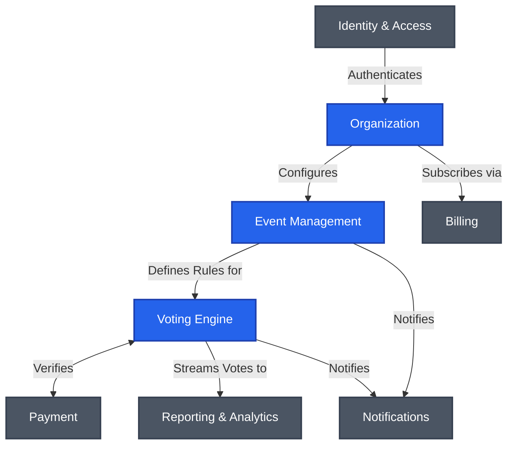

# Bounded Contexts & Context Map

OmniVote is divided into distinct Bounded Contexts. This separation ensures loose coupling, clear boundaries, and allows independent evolution.

## Major Bounded Contexts

### 1. Identity & Access Context
* **Responsibility**: Manages authentication, authorization, user profiles, and API access.
* **Inclusions**: Users, Sessions, API Keys, Passwords, MFA.
* **Exclusions**: Organization membership details (belongs to Organization Context).

### 2. Organization Context
* **Responsibility**: Manages tenant isolation, workspaces, team members, roles, and platform branding.
* **Inclusions**: Organizations, Workspaces, Members, Roles, Permissions, Organization Settings.
* **Exclusions**: Billing and invoicing (belongs to Billing Context).

### 3. Event Management Context
* **Responsibility**: Handles the lifecycle, configuration, and setup of voting events before and after they run.
* **Inclusions**: Events, Event Types, Categories, Candidates, Event Timelines.
* **Exclusions**: The actual processing of live votes (belongs to Voting Engine).

### 4. Voting Engine Context
* **Responsibility**: The high-throughput, highly available core that processes incoming votes, enforces eligibility, and guarantees immutability.
* **Inclusions**: Votes, Ballots, Voters, Eligibility Rules.
* **Exclusions**: Candidate creation or payment processing.

### 5. Payment Context
* **Responsibility**: Processes financial transactions for paid voting, manages payment gateways, and handles refunds.
* **Inclusions**: Payments, Transactions, Gateways, Currency, Vote Packages.
* **Exclusions**: Organization subscription billing.

### 6. Reporting & Analytics Context
* **Responsibility**: Calculates results, generates post-event reports, and provides real-time analytical dashboards.
* **Inclusions**: Results, Leaderboards, Statistics, Exports.
* **Exclusions**: Live transaction processing.

### 7. Notifications Context
* **Responsibility**: Orchestrates outbound communications and webhooks based on domain events.
* **Inclusions**: Email Templates, SMS Delivery, Webhooks, Notification Subscriptions.

### 8. Billing Context
* **Responsibility**: Manages organization subscriptions, platform fees, and invoicing.
* **Inclusions**: Subscriptions, Invoices, Usage Quotas.

## Domain Context Map

