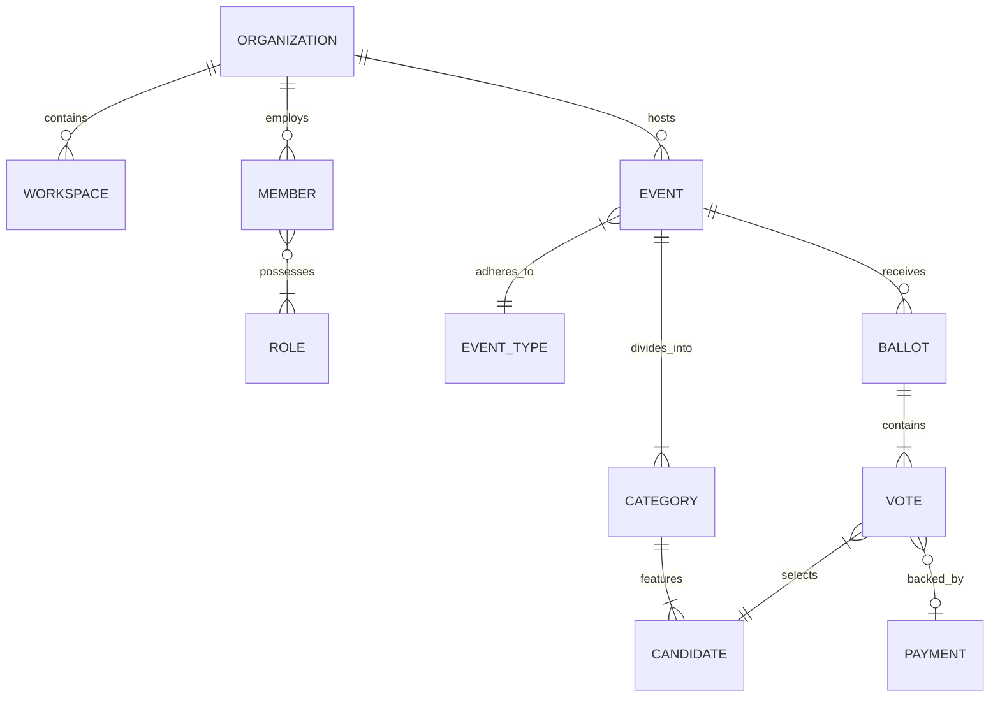
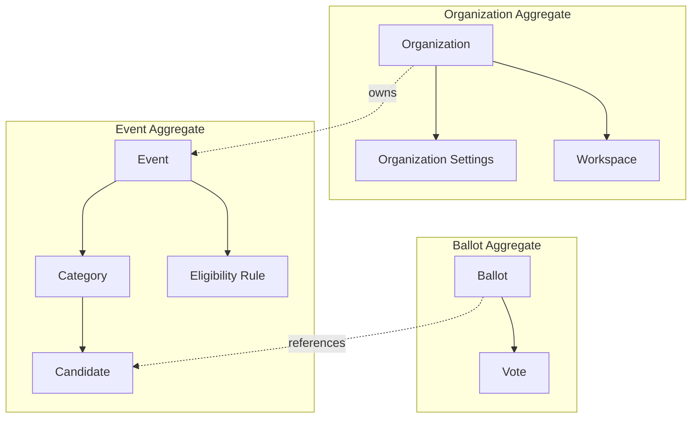
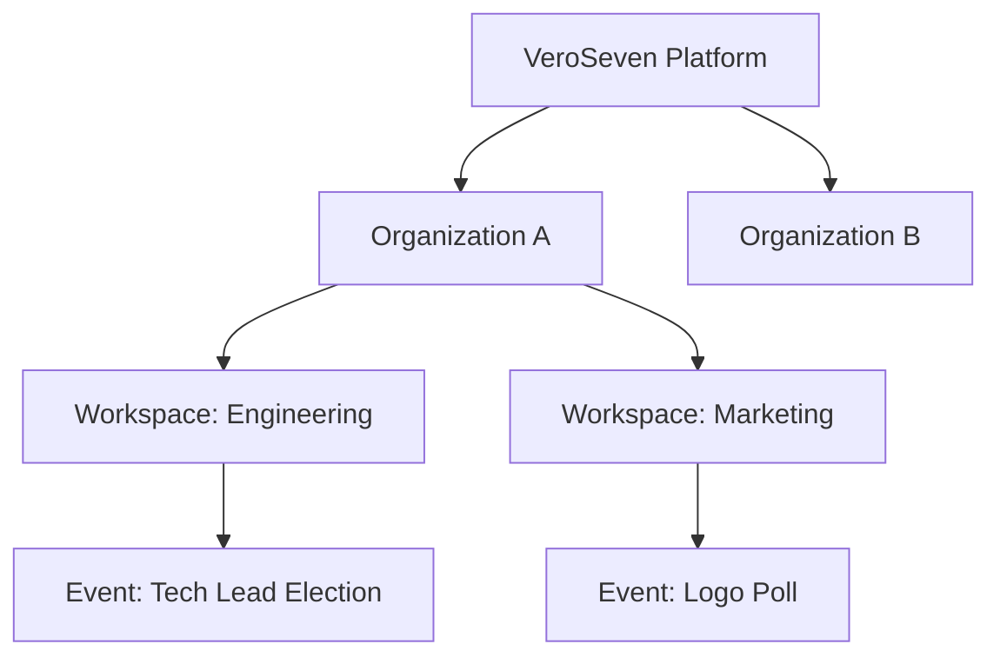
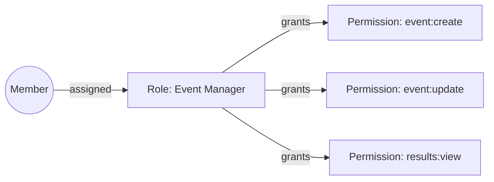

# OmniVote Domain Model

## 1. Product Domain Overview
**OmniVote** is an enterprise-grade, multi-tenant SaaS voting platform. It is designed to be a singular, event-driven engine capable of powering a diverse array of voting scenarios—from strict democratic corporate elections to high-throughput, revenue-generating reality show contests.

**The Problem:** Organizations typically use fragmented tools—one for employee surveys, another for board elections, and custom agencies for public paid voting. OmniVote centralizes this, providing a unified, auditable, and secure platform.

**Primary Users:**
*   **Platform Admins:** VeroSeven staff managing billing and global infrastructure.
*   **Organization Members:** Election officers, HR managers, or marketing teams configuring events.
*   **Voters:** Employees, students, or the general public casting votes.

## 4. Core Business Entities

### Organization
*   **Purpose**: The primary tenant boundary.
*   **Responsibilities**: Owns all data, configurations, and billing.
*   **Lifecycle**: Created upon signup, exists indefinitely unless explicitly hard-deleted.
*   **Important Rules**: Strict data isolation.

### Member
*   **Purpose**: Represents an individual operating on behalf of an Organization.
*   **Responsibilities**: Manages events, views results based on Roles.
*   **Relationships**: Belongs to one Organization, possesses many Roles.

### Event
*   **Purpose**: A specific voting instance.
*   **Lifecycle**: Draft -> Scheduled -> Live -> Closed -> Archived.
*   **Ownership**: Owned by an Organization.
*   **Important Rules**: Dictated by its `Event Type` blueprint.

### Category
*   **Purpose**: A specific race (e.g., "President").
*   **Relationships**: Belongs to exactly one Event. Owns many Candidates.

### Candidate
*   **Purpose**: The entity receiving votes.
*   **Relationships**: Belongs to exactly one Category.

### Vote
*   **Purpose**: The record of a Voter's choice.
*   **Responsibilities**: Must remain completely immutable.
*   **Relationships**: Belongs to an Event, a Category, and a Candidate.

## 5. Entity Relationships (Conceptual)

## 9. Multi-Tenant Architecture
OmniVote utilizes a logical multi-tenancy model. A single database instance serves all tenants, separated strictly by an `organization_id` foreign key on all root tables.
*   **Security Boundary**: API endpoints extract the tenant ID from the authenticated user's token and automatically append it to all database queries via middleware, preventing cross-tenant data leaks.
*   **Future White-Label**: Organizations will be able to map custom domains (e.g., `vote.company.com`) which the system will resolve to their tenant context seamlessly.

## 10. Roles & Permissions Philosophy
OmniVote implements a highly granular Role-Based Access Control (RBAC) system.
*   **Principle of Least Privilege**: Users default to zero access.
*   **System Roles vs. Custom Roles**: The system provides immutable defaults (e.g., `Org Admin`, `Event Manager`, `Read-Only Auditor`), but allows Organizations to compose custom roles from atomic permissions (e.g., `can_create_event`, `can_view_live_results`).

## 16. Risks & Mitigation
*   **Duplicate Voting**: *Mitigation*: Strong idempotency keys on Ballot submission. Database-level unique constraints on `(event_id, voter_identity)` for strict elections.
*   **Result Manipulation**: *Mitigation*: Results are never stored as static modifiable fields; they are always materialized views or cached projections derived dynamically from the immutable `Vote` table.
*   **Payment Inconsistencies**: *Mitigation*: Votes associated with payments are held in a `pending` state until cryptographically verified webhooks from the payment gateway confirm settlement.

## 18. Architecture Decisions

### Decision 1: Single Event Engine vs. Dedicated Modules
*   **Decision**: Use a single, configurable Event Engine.
*   **Reason**: Prevents codebase fragmentation. Maintaining separate codebases for "Elections" and "Paid Contests" leads to duplicated effort (e.g., both need basic validation, time windows, and result calculation).
*   **Trade-off**: The configuration model is more complex upfront.

### Decision 2: Soft Deletes vs. Hard Deletes
*   **Decision**: Use Soft Deletes (`deleted_at` timestamp) for all core domain entities.
*   **Reason**: Regulatory compliance and auditability. We must retain historical data for election audits.

## 19. Additional Mermaid Diagrams

### Aggregate Relationships

### Organization Ownership Hierarchy

### Member & Permission Relationships

