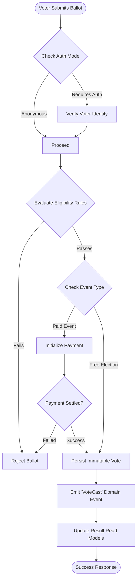

# Event Engine Model

The Event Engine is the beating heart of OmniVote. Instead of building separate modules for "Elections," "Awards," and "Surveys," OmniVote utilizes a single, unified Event Engine driven by configuration.

## The Configuration-Driven Paradigm
The Event Engine operates purely on generic concepts: `Events`, `Categories`, `Candidates`, and `Votes`. The *behavior* of how these entities interact is dictated by the `Event Type` and `Eligibility Rules` attached to the Event.

This prevents duplicate logic. A Student Election and a Reality Show operate on the same engine; the engine simply enforces different validation pipelines based on the Event Type configuration.

## Configurable Capabilities (Event Types)
An Event Type acts as a blueprint, toggling capabilities on or off:

*   **Authentication Mode**: Anonymous, Single Sign-On (SSO), OTP, or Magic Link.
*   **Payment Gateway**: Disabled (Elections) or Enabled (Paid Contests).
*   **Vote Quotas**: Single Vote per Voter, Multiple Votes, or Infinite Votes (Paid).
*   **Result Visibility**: Public (Live Leaderboards) or Hidden (Blind Elections).
*   **Voter Anonymity**: Strict (Identity decoupled from Vote) or Tracked.
*   **Access Channels**: Web, Mobile API, USSD, SMS.

## Event Engine Flow

## Future Extensibility
By keeping the engine generic, adding a new event type (e.g., "Shareholder Referendum") does not require structural database changes. It only requires defining a new `Event Type` configuration blueprint with specific eligibility rules (e.g., vote weight based on share volume).
