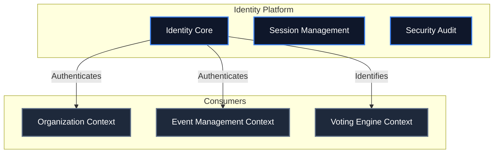
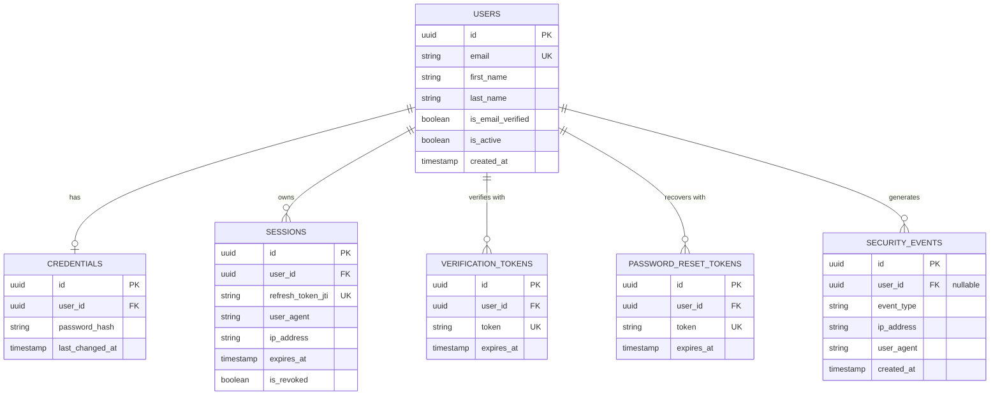

# VeroSeven Identity Platform Architecture

## Executive Summary
The VeroSeven Identity Platform is a foundational module providing authentication, identity, session management, and security auditing. While initially serving OmniVote, it is designed as a reusable bounded context to support future VeroSeven products (e.g., Nexra). The Identity module operates completely independently of OmniVote's core business logic (elections, votes, organizations).

## Platform Boundaries

### What the Identity Platform Owns
* **Users**: Human identities and core profile data.
* **Credentials**: Hashes, salts, and authentication secrets.
* **Sessions**: Active authentication states and tokens.
* **Verification**: Email tokens, password reset flows, and account activation.
* **Security Events**: Auditable authentication logs (e.g., logins, failed attempts, password changes).

### What the Identity Platform Does NOT Own
* **Organizations / Workspaces**: Multi-tenant isolation belongs to the Organization Context. A User always owns their own platform account, and establishes relationships with Organizations via Memberships.
* **Roles / Permissions (RBAC)**: App-specific access control belongs to the consuming application. Ownership is an RBAC role on a Membership, not an Identity property.
* **Elections / Voting**: Event business logic remains in the OmniVote Event Engine.

---

## Domain Concepts

1. **User**: Represents a human identity. Uniquely identified by email.
2. **Credential**: Represents the authentication secrets (Argon2 hashes) tied to a User.
3. **Session**: Represents an authenticated state, containing access/refresh tokens and device metadata.
4. **Verification Token**: Short-lived tokens used for email address verification.
5. **Password Reset Token**: Secure tokens for recovering access.
6. **Security Event**: Immutable ledger of authentication and security-related actions.

---

## Dependency Relationships & Context Map

The Identity Platform acts as a **Supplier** to all other Bounded Contexts. Other contexts consume Identity, but Identity has **no outgoing dependencies** on business logic.



---

## Entity Relationship Diagram (ERD)



---

## Package / Module Structure

To guarantee reusability, the Identity Platform will be completely encapsulated within its own sub-directories, strictly avoiding cross-imports with OmniVote business domains.

### Backend (FastAPI)
```
apps/api/app/identity/          # Isolated Identity Module
├── api/
│   ├── v1/
│   │   ├── auth.py             # Login, logout, refresh
│   │   ├── users.py            # Profile, registration
│   │   └── recovery.py         # Passwords, verification
├── models/                     # SQLAlchemy models for User, Session, etc.
├── schemas/                    # Pydantic models for identity payloads
├── services/                   # Identity domain logic (hashing, JWTs)
└── exceptions.py               # Identity-specific error handling
```

### Frontend (React / Vite)
```
apps/web/src/features/identity/ # Isolated Identity UI
├── components/                 # LoginForm, RegisterForm, ResetPasswordForm
├── pages/                      # LoginPage, RegisterPage, VerificationPage
├── hooks/                      # useAuth, useSession
├── services/                   # identityApi.ts
├── schemas/                    # Zod validation schemas
└── stores/                     # Zustand authStore.ts
```

---

## Technology Stack Extensions
* **Hashing**: `argon2-cffi` for Passwords, `hashlib.sha256` for short-lived link tokens.
* **Tokens**: `PyJWT` for stateless Access Tokens + Stateful Refresh Tokens stored in PostgreSQL.
* **API Protection**: FastAPI Dependency Injection (`get_current_user`).

---

## Security Hardening Details
* **Passwords**: Never logged. Argon2 hashing.
* **Refresh Tokens**: Hashed with Argon2 before storage in the database.
* **Link Tokens (Verification / Reset)**: Generated using `secrets.token_urlsafe(32)` (256-bit entropy) and hashed with SHA-256 before database storage to prevent database leak compromise.
* **Sanitization**: API responses are scrubbed of password hashes, SQL errors, and stack traces.
