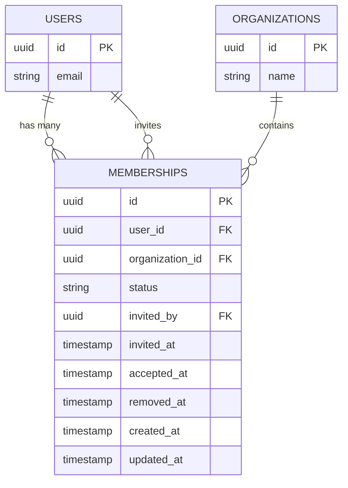
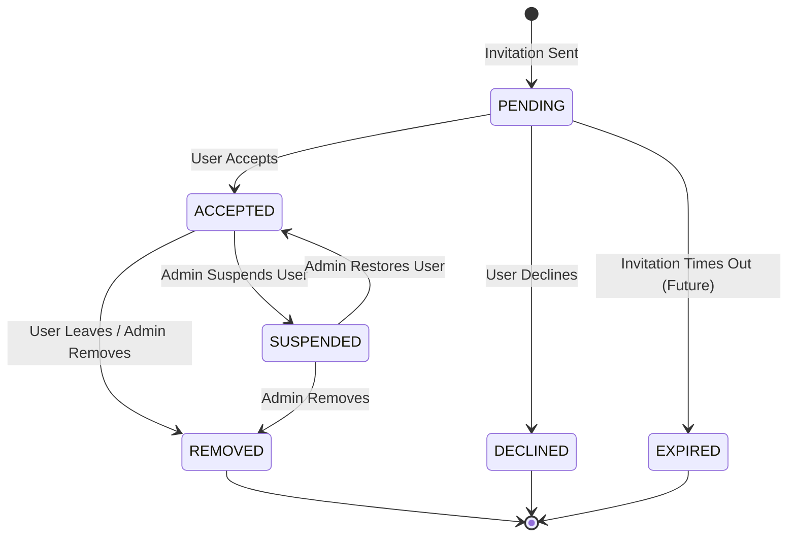
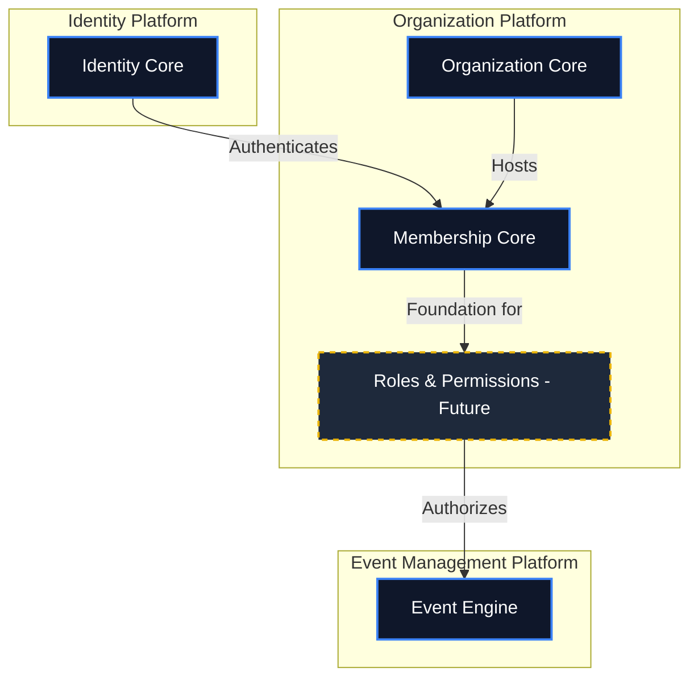

# VeroSeven Membership Platform Architecture

## Executive Summary
The Membership domain is a crucial bounded context within the VeroSeven platform. Its sole responsibility is to represent and manage the relationship between a platform `User` and an `Organization`. 

Membership is strictly relational metadata. It is **not** a voter, it is **not** an election participant, and it does **not** inherently carry roles or permissions. Future platform capabilities (Roles & Permissions, Teams, Billing, and Activity Tracking) will use Membership as their foundational building block.

## Platform Boundaries

### What the Membership Platform Owns
* **Relationship Metadata**: The explicit connection between a `User` and an `Organization`.
* **Membership Lifecycle**: The state machine governing the relationship (Pending, Accepted, Suspended, Removed).
* **Invitation State**: Tracking who invited the user, when they were invited, and when they accepted.

### What the Membership Platform Does NOT Own
* **Authentication**: Login and credentials belong to the Identity Platform.
* **Authorization / RBAC**: Roles, permissions, and access rules belong to a separate Roles & Permissions domain.
* **Voting Eligibility**: Whether a member can vote in an election is governed by the Event Management and Voting Engine contexts.
* **Billing / Subscriptions**: Billing logic belongs to the Billing Context.
* **Notification Delivery**: Emailing invitations belongs to the Notifications Context.

---

## Domain Model

### Membership Entity

The `Membership` entity represents the relational bridge. 

**Recommended Schema Fields:**
* `id` (UUID): Primary Key
* `user_id` (UUID): Foreign Key -> Identity Context (`users`)
* `organization_id` (UUID): Foreign Key -> Organization Context (`organizations`)
* `status` (Enum): Current lifecycle state (e.g., Pending, Accepted).
* `invited_by` (UUID): Foreign Key -> Identity Context (`users`) representing the inviter.
* `invited_at` (Timestamp): When the invitation was sent.
* `accepted_at` (Timestamp, nullable): When the user accepted the invitation.
* `removed_at` (Timestamp, nullable): When the membership was terminated.
* `created_at` (Timestamp): Record creation.
* `updated_at` (Timestamp): Record last update.

### Entity Relationship Diagram (ERD)



---

## Membership Lifecycle

The Membership lifecycle dictates how a User transitions into and out of an Organization.



---

## Dependency Relationships & Context Map

Membership bridges Identity and Organizations, providing a foundation for future context modules.



---

## Package / Module Structure

Following the established VeroSeven patterns, the Membership module will be tightly encapsulated to prevent business logic leakage.

### Backend (FastAPI)
```
apps/api/app/membership/        # Isolated Membership Module
├── api/
│   ├── v1/
│   │   ├── invitations.py      # Invitation generation & acceptance
│   │   └── members.py          # Listing, suspending, removing members
├── models/                     # SQLAlchemy models for Membership
├── schemas/                    # Pydantic models for inputs/outputs
├── repositories/               # Database interaction layer
├── services/                   # Business logic (lifecycle transitions)
├── dependencies/               # Specific dependency injection
└── exceptions.py               # Domain-specific error handling
```

### Frontend (React / Vite)
```
apps/web/src/features/membership/
├── components/                 # MemberList, InviteModal, StatusBadge
├── pages/                      # MembersPage, AcceptInvitationPage
├── services/                   # membershipApi.ts
├── schemas/                    # Zod validation schemas
└── stores/                     # Optional state management
```

---

## Future Extension Points
While currently out of scope, the Membership design allows for seamless integration of:
1. **Roles & Permissions (RBAC)**: Binding permission policies directly to a specific `membership_id` rather than a global `user_id`.
2. **Teams / Departments**: Grouping `membership_id`s into logical units within an Organization.
3. **Billing**: Calculating active seat counts by counting `status = 'ACCEPTED'` memberships.
4. **Activity Tracking**: Scoping user activity logs tightly to their specific membership context.
