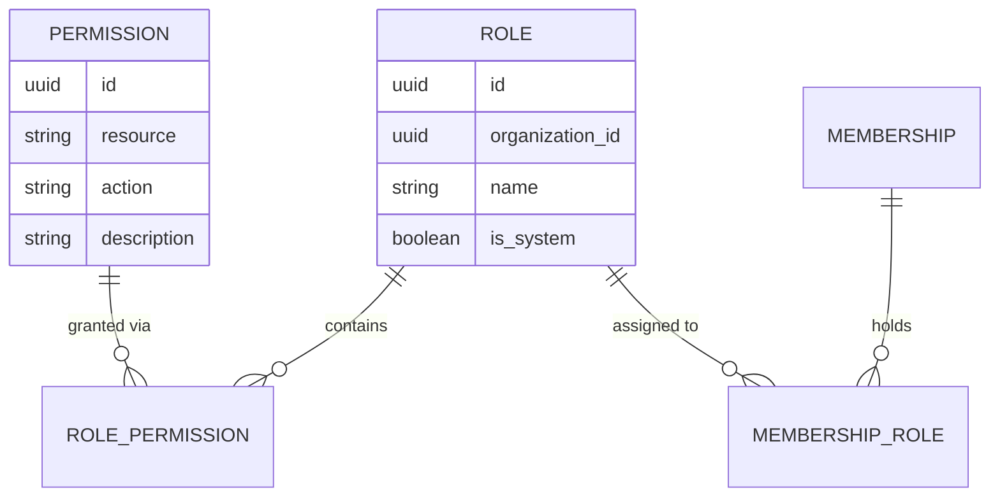
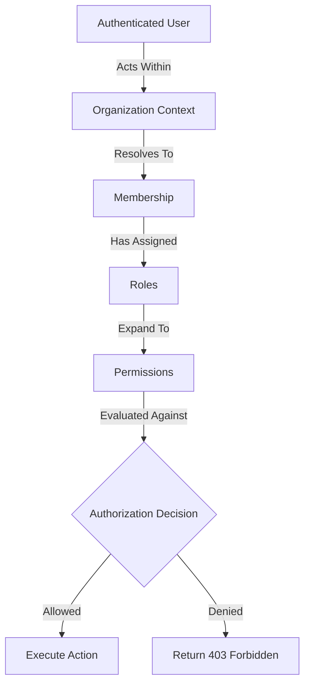

# Role-Based Access Control (RBAC) Platform Architecture

## Executive Summary
The Role-Based Access Control (RBAC) module acts as the core authorization engine for the VeroSeven Platform. RBAC determines what authenticated users are allowed to do within the context of an Organization.

RBAC extends the Platform Layer and strictly interoperates with:
* **Identity**: For verifying the authenticated user.
* **Organizations**: For contextualizing the authorization domain.
* **Memberships**: For binding authorization logic to a user's participation in an organization.

> [!IMPORTANT]
> The RBAC domain is entirely unconcerned with OmniVote-specific business logic. It does not natively "know" about elections, voters, or ballots, but instead provides an engine capable of guarding those resources.

---

## Domain Model

The RBAC domain introduces four core entities:

### 1. Permission
Represents a single atomic platform capability.
* **Format**: Follows the `resource.action` naming convention (e.g., `organization.view`).
* **Scope**: Defines *what* can be done, but not *who* can do it.

### 2. Role
Represents a named collection of permissions.
* **Examples**: Owner, Administrator, Election Manager, Auditor.
* **Scope**: Roles generally belong to a specific Organization context, though "System Roles" may exist globally.

### 3. RolePermission
A mapping entity that associates `Roles` with `Permissions`.
* **Relationship**: Many-to-Many. A Role contains many Permissions, and a Permission can be associated with multiple Roles.

### 4. MembershipRole
A mapping entity that associates organizational `Memberships` with `Roles`.
* **Relationship**: Many-to-Many. A Membership may hold multiple Roles concurrently, and a Role is assigned to many Memberships.



---

## Authorization Principles

### Strict Membership Binding
**Authorization decisions must always be based on Membership.**
1. **Never** attach permissions directly to Users (Identity). Users act across multiple organizations.
2. **Never** attach permissions directly to Organizations.
3. Instead, a `Membership` acts as the bridge. A User acting within an Organization assumes the capabilities of their `Membership`, which dictates their active `Roles`.

### Permission Resolution Flow
When determining if a user can execute an action, the flow is:



---

## Permission Naming Convention

Permissions must follow a strict, lowercase `resource.action` syntax.
Avoid inconsistent phrasing or plural/singular mismatches.

| Resource | Action | Permission Name | Description |
| :--- | :--- | :--- | :--- |
| `organization` | `view` | `organization.view` | View organization settings and metadata |
| `organization` | `update` | `organization.update` | Modify organization profile or billing |
| `member` | `invite` | `member.invite` | Send invitations to join the organization |
| `member` | `remove` | `member.remove` | Revoke a user's membership |
| `event` | `create` | `event.create` | Draft a new voting event |
| `event` | `publish` | `event.publish` | Transition an event to scheduled or live |
| `candidate` | `manage` | `candidate.manage` | Add, update, or remove candidates |
| `ballot` | `manage` | `ballot.manage` | Configure ballot logic and layout |
| `results` | `view` | `results.view` | View real-time or concluded results |
| `results` | `publish` | `results.publish` | Make election results publicly accessible |
| `system.audit` | `view` | `system.audit.view` | View the organization's audit log |

---

## Module Boundaries

### RBAC Owns:
* Roles (Creation, updating, listing)
* Permissions (System-wide dictionary of available actions)
* Permission Resolution (Computing active permissions for a Membership)
* Authorization Decisions (Dependency guards checking `HasPermission`)

### RBAC Does NOT Own:
* Authentication (Identity)
* Organizations (Tenant lifecycle)
* Membership Lifecycle (Pending/Accepted states are handled by Membership Domain)
* OmniVote logic (Elections, votes, ballots)

### Backend Package Structure
Following the modular monolith design, the RBAC platform module will reside at:
```text
apps/api/app/
└── modules/
    └── rbac/
        ├── models/              # Role, Permission, MembershipRole, RolePermission
        ├── schemas/             # Pydantic schemas for API validation
        ├── repositories/        # SQLAlchemy CRUD and relationship mapping
        ├── services/            # Business logic (e.g., computing permissions)
        ├── authorization/       # Decorators, dependencies, and rule evaluators (e.g., HasPermission)
        ├── routes/              # FastAPI endpoints for managing Roles/Assignments
        └── tests/               # Isolated unit & integration tests
```

---

## Extension Points
The RBAC Foundation is designed to support the following future capabilities without architectural rewrites:

1. **System Roles vs. Custom Roles**: Initial implementations may lock roles down to platform-defined defaults (e.g., "Owner", "Admin"). The architecture supports custom role creation per organization by setting `organization_id` on the `Role` entity.
   - **The Owner Role**: The Owner role is a reserved system role assigned to a `Membership`. It represents organization ownership. Every organization must always have at least one Membership with the Owner role.

2. **Authorization Rule**: Permission resolution must always follow:
   `User -> Membership -> Role(s) -> Permission(s) -> Authorization Decision`
   Permissions are NEVER attached directly to Users or Organizations.

3. **Permission Groups**: UI-driven abstractions allowing users to toggle "Event Management" which under the hood maps to multiple granular permissions (`event.create`, `candidate.manage`, etc.).

4. **ABAC (Attribute-Based Access Control)**: Future integration allowing policies such as "User can manage Event ONLY IF User is Event Owner."

5. **Policy Engine**: Integration with OPA (Open Policy Agent) or similar sidecars for decentralized policy evaluation across microservices, using this DB schema as the source of truth.
