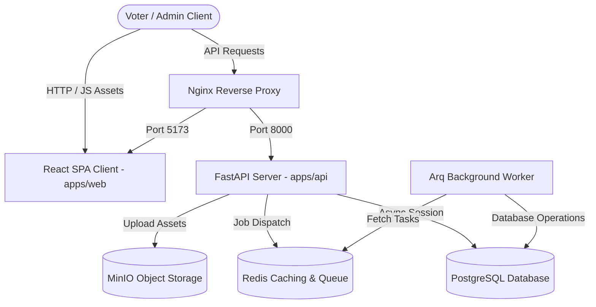
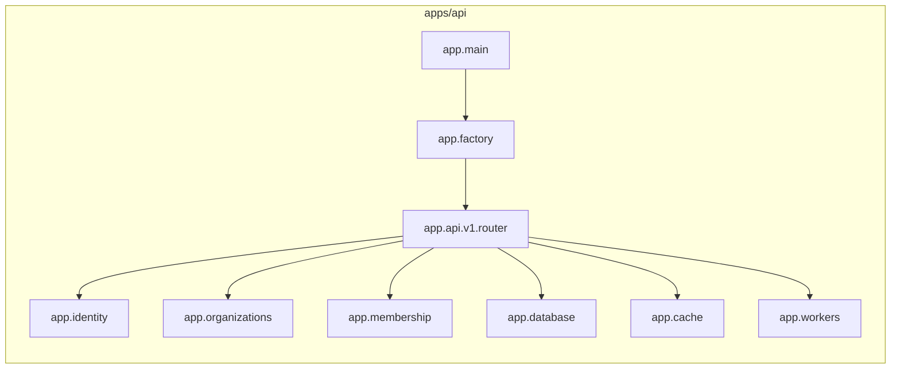

# System Overview & Architecture Diagrams

This document defines high-level architecture designs, component relationships, and infrastructure networking layouts for the OmniVote platform.

---

## 1. System Architecture Diagram

---

## 2. Database Architecture Layout (Placeholder)

> [!NOTE]
> Detailed domain mappings, table indexes, constraints, and foreign key relations are documented in [docs/database/domain_model_and_db_design.md](file:///c:/Users/DELL/omnivote/docs/database/domain_model_and_db_design.md).
> An entity relationship diagram (ERD) placeholder will be generated here upon database schema finalization.

---

## 3. Module Relationship Matrix (Placeholder)

---

## 4. Deployment Network Topology (Placeholder)

> [!NOTE]
> In local development environments, all services communicate inside a bridge-isolated bridge network (`omnivote-network`) managed via Docker Compose.
> Production network topologies (showing load balancers, secure database subnets, cache clusters, and replica bounds) will be added here prior to the production delivery phase.
