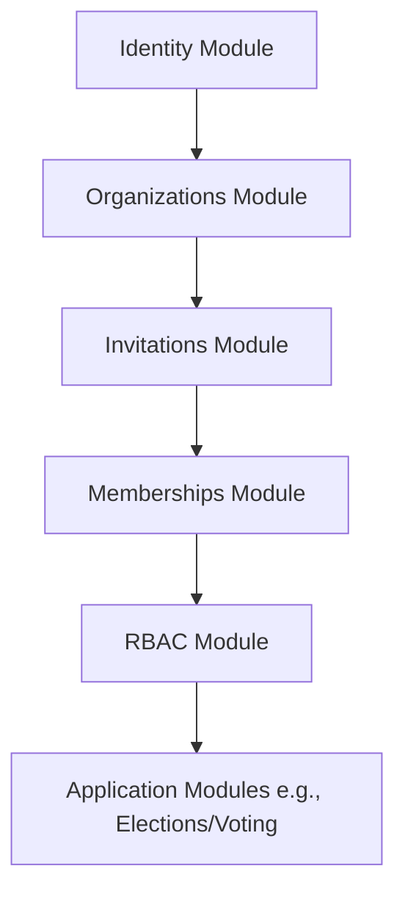
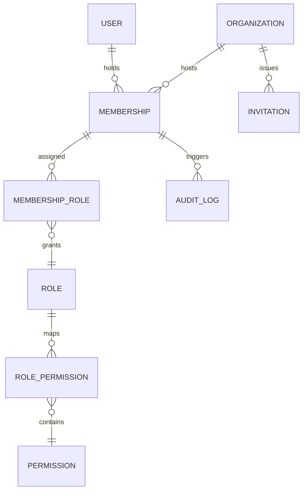
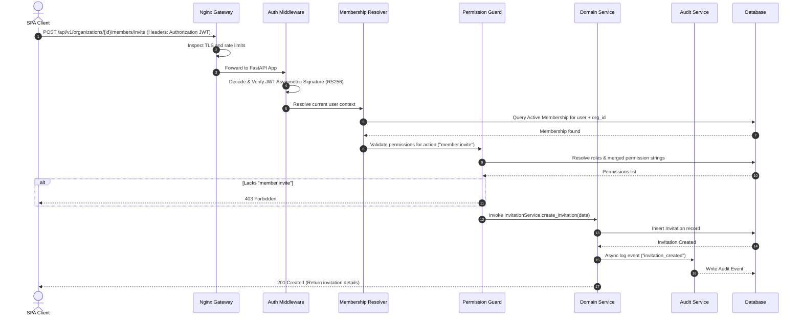

# VeroSeven Platform Architecture Book
**The Canonical Engineering Reference for the VeroSeven Multi-Tenant Platform**  
*Version: v0.2.4-alpha*

---

## Document Metadata
* **Status**: Canonical Reference / Release Ready
* **Target Version**: v0.2.4-alpha
* **Author**: Core Platform Architecture Team
* **Last Modified**: 2026-07-20

---

## Table of Contents

1. [Part I — Vision](#part-i-vision)
2. [Part II — Engineering Principles](#part-ii-engineering-principles)
3. [Part III — Platform Architecture](#part-iii-platform-architecture)
4. [Part IV — Domain Model](#part-iv-domain-model)
5. [Part V — Request Lifecycle](#part-v-request-lifecycle)
6. [Part VI — Security Architecture](#part-vi-security-architecture)
7. [Part VII — API Standards](#part-vii-api-standards)
8. [Part VIII — Data Architecture](#part-viii-data-architecture)
9. [Part IX — Frontend Architecture](#part-ix-frontend-architecture)
10. [Part X — Coding Standards](#part-x-coding-standards)
11. [Part XI — Architecture Decision Records (ADR)](#part-xi-architecture-decision-records-adr)
12. [Part XII — Roadmap](#part-xii-roadmap)
13. [Part XIII — Engineering Values](#part-xiii-engineering-values)
14. [Appendix: Glossary & Acronyms](#appendix-glossary-acronyms)
15. [Revision History & Log](#revision-history-log)

---

## Part I — Vision

### Platform Mission
The VeroSeven Platform is engineered to be the unified, highly secure, and performance-resilient digital foundation powering complex administrative, relationship-management, and high-throughput voting scenarios. Under the motto **"One System. Every Vote."**, the platform provides software capabilities that transcend standard single-purpose systems, bridging the gap between closed, high-security democratic elections and public-facing, high-throughput commercial contests.

### Engineering Philosophy
Our architecture values clean, maintainable boundaries above clever optimizations. Code is written first for readability by other engineers and second for interpretation by compilers. We favor:
* Strong types and strict boundary validation.
* Monolithic structure with modular division (Modular Monolith).
* Total logical multi-tenant isolation.
* Uncompromising transaction safety.

### Design Goals
* **Strict tenant-key data separation**: Prevent data leaks at both the ORM level and database routing level.
* **Deterministic identity boundaries**: Users maintain global accounts, and organizations own relationships (memberships), not user records.
* **Granular permission controls**: Actions are authenticated via access tokens and authorized by dynamic membership-level permission maps.
* **Minimal visual latency**: Provide instant client interactions, offline caching capabilities, and robust background queues.

### Multi-Tenant Architecture
Multi-tenancy on the VeroSeven platform follows a shared-database, logical-isolation pattern. All records that belong to a tenant feature an `organization_id` foreign key. The application layer automatically extracts this tenant context from authentication scopes and appends filters dynamically, creating a virtual private database for every organization.

---

## Part II — Engineering Principles

### Modular Monolith
To reduce operational overhead and network serialization delays, VeroSeven is built as a **Modular Monolith**. Rather than partitioning into distinct microservices, modules share a single deployment footprint but are isolated at the code boundary. Communications between modules occur via clear method invocations and event subscriptions, preparing the system for eventual microservices splitting if scaling parameters require it.

```
┌────────────────────────────────────────────────────────┐
│                   VeroSeven Monolith                   │
│                                                        │
│ ┌──────────────┐  ┌──────────────┐  ┌────────────────┐ │
│ │   Identity   │  │Organizations │  │  Invitations   │ │
│ └──────────────┘  └──────────────┘  └────────────────┘ │
│ ┌──────────────┐  ┌──────────────┐  ┌────────────────┐ │
│ │ Memberships  │  │     RBAC     │  │     Audit      │ │
│ └──────────────┘  └──────────────┘  └────────────────┘ │
└────────────────────────────────────────────────────────┘
```

### Separation of Concerns & Clean Architecture
Modules are layered according to standard clean architecture guidelines:
1. **API Router Layer**: Processes HTTP JSON requests, maps schema inputs via Pydantic/Zod, and coordinates responses.
2. **Domain Service Layer**: Implements core business logic, checks authorization invariants, and initiates domain events.
3. **Repository Layer**: Manages database access patterns (SQLAlchemy/Prisma), abstracting query compilation.
4. **Data Access Model Layer**: Decoupled models holding validation constraints and database schemas.

### API-First Design
API endpoints are defined first via OpenAPI specifications in [api_specification.md](file:///c:/Users/DELL/omnivote/docs/api/api_specification.md). Routers are structured strictly to align with these contracts, allowing developers to build frontend structures and test suites in parallel with backend endpoints.

### Security and Auditability by Design
No backend transaction occurs without structural permission validation. Additionally, critical mutations trigger asynchronous event logging through a specialized Audit system. The audit trail is write-once and cryptographically stable, ensuring that historical administrative actions can be validated during compliance reviews.

---

## Part III — Platform Architecture

The platform consists of several core components, organized in a clear dependency hierarchy.

### Dependency Chain


### Module Specifications

#### 1. Identity Module
* **Responsibilities**: Manages user accounts, authentication credentials, passwords (Argon2id), session tokens, and security events.
* **Boundaries**: Operates globally. The identity module has no knowledge of organizations or membership contexts.
* **Public APIs**: `POST /api/v1/identity/auth/register`, `POST /api/v1/identity/auth/login`, `GET /api/v1/identity/users/me`.
* **Dependencies**: External SMTP/SMS gateways for verification.

#### 2. Organizations Module
* **Responsibilities**: Manages tenant setup, metadata (slugs, names), operational statuses (`Active`, `Suspended`), and verification statuses (`Unverified`, `Verified`).
* **Boundaries**: Owns organization entities. Does not manage user data or permission records directly.
* **Public APIs**: `POST /api/v1/organizations/`, `GET /api/v1/organizations/{id}`, `PATCH /api/v1/organizations/{id}`.
* **Dependencies**: Identity Module (requires an active user during creation).

#### 3. Invitations Module
* **Responsibilities**: Manages user invitation lifecycles (`PENDING`, `ACCEPTED`, `DECLINED`, `EXPIRED`), token generations, expiration thresholds, and recipient validation.
* **Boundaries**: Bridges identity and memberships. An invitation represents a *proposed* organizational relationship.
* **Public APIs**: `POST /api/v1/organizations/{org_id}/members/invite`, `POST /api/v1/invitations/{token}/accept`.
* **Dependencies**: Organizations Module, Email Service.

#### 4. Memberships Module
* **Responsibilities**: Defines active participants within an organization. Manages membership activation states, deletion cascades, and linking user records with tenant entities.
* **Boundaries**: Strictly relational. Memberships bridge exactly one User and one Organization.
* **Public APIs**: `GET /api/v1/organizations/{org_id}/members/`, `DELETE /api/v1/organizations/{org_id}/members/{membership_id}`.
* **Dependencies**: Organizations, Identity.

#### 5. RBAC Module
* **Responsibilities**: Resolves role mappings, manages role-permission links, enforces authorization guards, and controls role modifications.
* **Boundaries**: Resolves access contexts using `Membership`. System permissions are global; roles can be global or organization-specific.
* **Public APIs**: `GET /api/v1/organizations/{org_id}/roles`, `POST /api/v1/organizations/{org_id}/members/{membership_id}/roles`.
* **Dependencies**: Memberships, Organizations.

#### 6. Platform Identity Module
* **Responsibilities**: Orchestrates all platform-level access management, fully decoupled from Organization Membership. Encompasses Platform Users, Roles, Permissions, Invitations, Sessions, Authentication, and Authorization.
* **Boundaries**: Manages global platform administrators. Has no tenant context.
* **Public APIs**: `GET /api/v1/platform/users`, `POST /api/v1/platform/invitations`.
* **Dependencies**: Identity Module, RBAC Module.

#### 7. Audit Module
* **Responsibilities**: Captures structural event logging, records actor identity, action type, IP address, and payload parameters.
* **Boundaries**: Write-only model. Events cannot be deleted or modified.
* **Public APIs**: Internal service invocation only.

---

## Part IV — Domain Model

### Major Domain Entities
The platform's relational integrity is guided by the following entity specifications:



1. **User**
   * **Purpose**: Represents a global platform identity.
   * **Relationships**: Has zero-to-many Memberships.
   * **Constraints**: Email must be unique. Username must be unique.
2. **Organization**
   * **Purpose**: Primary tenant isolation boundary.
   * **Relationships**: Owns many Memberships and Invitations.
   * **Constraints**: Slug must be unique and URL-friendly.
3. **Membership**
   * **Purpose**: Connects a User to an Organization.
   * **Relationships**: Belongs to one User and one Organization. Owns many MembershipRoles.
   * **Constraints**: Composite key `(user_id, organization_id)` must be unique.
4. **Invitation**
   * **Purpose**: Proposed membership lifecycle record.
   * **Relationships**: Belongs to one Organization.
   * **Constraints**: Invitation token must be unique.
5. **Role**
   * **Purpose**: Bundles multiple Permissions.
   * **Constraints**: Unique name per organization context.
6. **Permission**
   * **Purpose**: A granular capability statement (e.g. `organization.update`).
   * **Constraints**: Name must be unique.

---

## Part V — Request Lifecycle

Every API request flows through standard layers of verification, context resolution, validation, authorization, and audit logging.



---

## Part VI — Security Architecture

### Authentication Model
Authentication uses secure, asymmetrical RS256 JWT tokens. The private key resides exclusively within the Identity Service config, and public API nodes verify tokens using the corresponding public key. Credentials are encrypted using the Argon2id hashing algorithm, ensuring high GPU resistance.

### Authorization Model (RBAC)
Authorization is mapped dynamically at runtime via membership roles:
1. Extract User ID and Organization ID.
2. Resolve active Membership.
3. Eager load all active roles associated with that membership.
4. Flatten and resolve all unique permission entries.
5. Confirm if the required permission key is present.

### Reserved Owner Role & Transfer
The `Owner` role is a protected configuration constraint.
* **Invariants**: Every organization must always have exactly one membership possessing the `Owner` role. The system prevents removing or revoking this role through standard update APIs.
* **Transfer**: Ownership is transferred atomically via the `POST /api/v1/organizations/{id}/transfer-ownership` endpoint, adding the role to the target membership and removing it from the sender under a single database transaction.

### Cascade Deletion Policies
To enforce data integrity, specific relational rules are set:
* Revoking a pending invitation deletes the invitation history.
* Deleting/revoking an accepted invitation cascades to automatically delete the associated user membership.

### Platform Administration & Temporary Support Access
The platform separates global administration from tenant-level operations:
* **Platform RBAC**: Decoupled from organizations. Global platform roles (e.g. `Platform Owner`, `Platform Administrator`) and platform permissions (e.g. `support.operate`, `organization.verify`) are assigned to users without requiring tenant organization membership. Secured using `RequirePlatformPermission` guards.
* **Customer Support Access**: Customers can submit a `SupportRequest` to grant platform administrators temporary visibility.
* **Support Session**: Accepting a support request starts a temporary `SupportSession` with a fixed expiration time and logged reason. Platform admins can also start an "Emergency Support Session" directly by documenting a reason, triggering high-priority audit events.
* **Bypass and Scope Limitation**: During an active support session, the authorization engine intercepts the tenant-level guard `RequirePermission` and evaluates permissions using the organization's system role `Platform Support`. This role grants strictly controlled read-only capabilities (`organization.view`, `member.view`, `election.view`, `results.view`, `audit.view`) to prevent administrators from modifying configuration settings or executing destructive actions. Every action performed during support sessions is explicitly audited under `support_access_action`.

### Custom Roles, Protection Rules & Privilege Escalation Prevention
Organization administrators can create and manage custom roles to delegate specialized authority:
* **Role Types**:
  * *Reserved System Roles*: System-seeded roles like `Owner`, `Admin`, `Member` have `organization_id == null` and `is_system == True`. These roles are immutable and cannot be deleted.
  * *Custom Roles*: Scoped to a specific organization (`organization_id` matches the tenant, `is_system == False`). Custom roles are editable and deletable.
* **Privilege Escalation Prevention**: An administrator can only create, update, or assign roles containing permissions that the administrator currently possesses.
* **Deletion Protection**: Reserved system roles cannot be deleted or have their default permissions modified by organization administrators.
* **Effective Permissions**: The platform provides a fast resolution endpoint `GET /api/v1/organizations/{org_id}/members/me/effective-permissions` returning the current user's flattened roles and distinct permission keys for frontend conditional rendering.

---

## Part VII — API Standards

VeroSeven strictly enforces the following API design patterns:

* **Endpoint Naming**: Plural nouns representing resources (e.g. `/api/v1/organizations/`).
* **Versioning**: Prefix endpoints with api version (`/api/v1/`).
* **Pagination**: Standard query parameters `limit` and `offset` returning a paginated wrapper:
  ```json
  {
    "items": [],
    "total": 100,
    "limit": 10,
    "offset": 0
  }
  ```
* **Validation**: All incoming requests pass through Pydantic validators. Violations trigger standard `422 Unprocessable Entity` responses.
* **Error Envelopes**: Structured error messages:
  ```json
  {
    "detail": "Invitation not found.",
    "code": "resource_not_found"
  }
  ```

---

## Part VIII — Data Architecture

### Database Design Principles
* Shared database, logical tenant isolation via `organization_id`.
* Every table must contain primary key `id` (UUIDv4/UUIDv7), `created_at`, and `updated_at`.
* Eager loading of critical relations must use `selectinload` or `joinedload` to prevent N+1 query execution.

### Indexing Strategy
* Clustered index on primary key UUIDs.
* Composite indexes on foreign keys to optimize joins:
  * Index on `(user_id, organization_id)` inside the `memberships` table.
  * Index on `(organization_id, status)` inside the `invitations` table.

### Repository Pattern
Direct query construction is prohibited inside routers. Database queries are encapsulated within Repositories (e.g., `MembershipRepository`), exposing clean interfaces that return domain schemas.

---

## Part IX — Frontend Architecture

The frontend is built using React, TypeScript, and Vite.

### Folder Structure
The UI follows a **Feature-First** layout structure:
```
apps/web/src/
├── components/          # Shared components (buttons, input fields)
│   └── ui/
├── features/            # Isolated business features
│   ├── identity/        # Logins, user signups
│   ├── organizations/   # Tenants profile management
│   ├── memberships/     # Member lists, invite dialogs
│   └── rbac/            # Roles mappings
├── hooks/               # Shared React hooks
├── layouts/             # Shared app shell layouts
└── routes/              # Declarative routing configurations
```

### State Management
* **Server State**: Handled via TanStack Query (`useQuery`, `useMutation`), managing API cache synchronization.
* **Local UI State**: Simple React context hooks or local component state properties.

### Permission-Aware UI
Elements are guarded on the client-side using a custom hook `useRbac()` and wrapper components like `<RequirePermission>`:
```tsx
<RequirePermission permission="member.invite">
  <BaseButton onClick={openInviteModal}>Invite Member</BaseButton>
</RequirePermission>
```

---

## Part X — Coding Standards

* **Naming Conventions**:
  * Python backend: variables and methods use `snake_case`, classes use `PascalCase`.
  * TypeScript frontend: variables use `camelCase`, components use `PascalCase`.
* **Testing Guidelines**:
  * Backend: tests written under `/tests/api` using `pytest`.
  * Frontend: components tested under `/tests` using `vitest` and Testing Library.
  * Integration: Playwright E2E suites verify multi-step request flows.
* **Documentation Guidelines**: Code changes must update inline docstrings and maintain markdown files in `/docs`.

---

## Part XI — Architecture Decision Records (ADR)

The system architecture decisions are captured below:

### [ADR-001] Monorepo Architecture Structure
* **Context**: Needed an integrated workflow for backend and frontend code bases.
* **Decision**: Implemented a monorepo setup to simplify dependency management and run cross-layer testing in a unified CI environment.

### [ADR-002] FastAPI & Async Database Session Framework
* **Context**: Highly concurrent API processing requires non-blocking database connectors.
* **Decision**: Adopted FastAPI utilizing async PostgreSQL drivers via SQLAlchemy to scale request performance efficiently.

### [ADR-006] Redis & Background Task Processing Foundation
* **Context**: Heavy transactional tasks (e.g., ballot tallies, emails) shouldn't block the API thread.
* **Decision**: Integrated Redis as a task broker driving asynchronous Celery workers.
* **Ref**: [ADR-006-background-processing.md](file:///c:/Users/DELL/omnivote/docs/decisions/ADR-006-background-processing.md)

### [ADR-007] Ownership Model via Membership Roles
* **Context**: Needed a secure mechanism to assign tenant-wide admin rights.
* **Decision**: Implemented the reserved `Owner` role assigned to a user's membership.
* **Ref**: [ADR-007-ownership-model.md](file:///c:/Users/DELL/omnivote/docs/decisions/ADR-007-ownership-model.md)

### [ADR-008] Separate Invitation Context & Lifecycle
* **Context**: Creating membership records prematurely during invite creation leaks data.
* **Decision**: Treated `Invitation` as a distinct database entity. Memberships are created only upon token acceptance.
* **Ref**: [0008-separate-invitation-context.md](file:///c:/Users/DELL/omnivote/docs/decisions/0008-separate-invitation-context.md)

### [ADR-009] Membership-Based Authorization & Global Permissions
* **Context**: Needed route security across multiple tenants.
* **Decision**: Implemented authorization checks resolved against the active membership context using granular permission scopes.
* **Ref**: [0009-membership-based-authorization.md](file:///c:/Users/DELL/omnivote/docs/decisions/0009-membership-based-authorization.md)

### [ADR-010] Separate Organization Verification Status
* **Context**: Trusted organization operations must run independently of operational suspensions.
* **Decision**: Decoupled `operational_status` from `verification_status` into separate columns.
* **Ref**: [0010-separate-organization-verification-status.md](file:///c:/Users/DELL/omnivote/docs/decisions/0010-separate-organization-verification-status.md)

### [ADR-011] Platform Administration and Support Access Model
* **Context**: Decoupling platform management from tenant organizations while offering secure, time-bound, and audited support access.
* **Decision**: Decoupled Platform RBAC from Organization RBAC, and implemented a temporary support session bypass where platform administrators are mapped to the read-only system role `Platform Support` with full audit logging.
* **Ref**: [0011-platform-rbac-and-support-access.md](file:///c:/Users/DELL/omnivote/docs/decisions/0011-platform-rbac-and-support-access.md)

### [ADR-012] Role Management, Protection Rules and Privilege Escalation Prevention
* **Context**: Securing the creation, update, and assignment of custom organization roles against privilege escalation while keeping system roles immutable.
* **Decision**: Enforced subset-permission checks at role creation/assignment time, protected system roles from mutation, and added a fast-flattening effective permissions query endpoint.
* **Ref**: [0012-role-management-and-protection-rules.md](file:///c:/Users/DELL/omnivote/docs/decisions/0012-role-management-and-protection-rules.md)

### [ADR-013] Platform Identity Bootstrap and Lifecycle Security
* **Context**: The platform required a secure mechanism to bootstrap the initial Platform Owner while preventing unauthorized privilege escalation or self-service access to platform administration.
* **Decision**: Implemented a secure backend bootstrap script (`scripts/bootstrap_platform.py`) that strictly limits itself to creating the initial Platform Owner. Once an owner exists, the script locks out. All future Platform Administrators must be onboarded exclusively through an explicit Platform Invitation workflow, ensuring full auditability and preventing shadow administration.

---

## Part XII — Roadmap

### Completed Capabilities
* Asymmetric RS256 authentication.
* Membership-based RBAC system.
* Invitation lifecycles and token accept validations.
* Ownership atomic transfer endpoints.

### Current Sprint Status (v0.2.4-alpha)
* Production hardening and bug resolution.
* Alignment of timezone-naive database fields with python timezone-aware datetimes.
* Client-side custom modal integration replacing native window dialogs.
* Verification of all test suites (Vitest & Pytest).

### Upcoming Work
* Multi-factor authentication (MFA).
* Audit log signature chaining.
* SMS / Email templates customizing modules.

---

## Part XIII — Engineering Values

VeroSeven engineers adhere to the following principles:
1. **Simplicity over Complexity**: Simple code requires less testing and is easier to modify.
2. **Identity is Global**: Users are platform-wide. Organizations do not own user accounts.
3. **Relationships define context**: Access rights are resolved through memberships, never through direct users configurations.
4. **Roles describe responsibilities**: Roles like Admin bundle responsibilities.
5. **Permissions describe capabilities**: Permissions like `organization.delete` describe granular actions.
6. **Every action is auditable**: Modifications of critical records must write immutable event logs.
7. **Documentation is as important as code**: Architecture books, API specs, and ADRs must be kept updated during every sprint closure.

---

## Appendix: Glossary & Acronyms

* **ADR**: Architecture Decision Record
* **Tenant**: A customer organization mapped inside the platform.
* **Membership**: An association linking one user to one tenant organization.
* **JWT**: JSON Web Token
* **OTP**: One-Time Password
* **RBAC**: Role-Based Access Control

---

## Revision History & Log

| Date | Version | Description | Author |
| --- | --- | --- | --- |
| 2026-07-20 | v0.2.4-alpha | Initial release of the Architecture Book consolidating current platform modules, ADRs, security architectures, and testing configurations. | Core Architecture Team |
