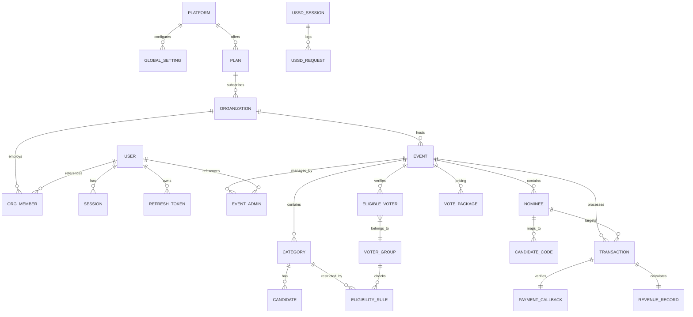

# OmniVote — Domain Model & Database Design v1.0
**One System. Every Vote.**
*Powered by VeroSeven*

---

## 1. Complete Domain Model
The business model of OmniVote is structured into core subdomains that separate global platform configurations, isolated tenant organizations, authentication, event lifecycles, voting mechanisms, and auditing.

### 1.1 Platform Subdomain
* **Platform Administrator:** Represents administrative accounts with system-wide viewing and configuration capabilities.
* **Global Setting:** Key-value pairs regulating platform fees, provider targets, and system-wide default options.
* **Feature Flag:** Toggles specific features dynamically across organizations or individual events.
* **Subscription Plan:** Defines system access limits, feature support (e.g., maximum voters, custom domains), and pricing structures.
* **System Announcement:** Broadcast notifications shown to organization administrators on the console.
* **Platform Audit Log:** Immutable logs tracking structural changes made by Platform Administrators.

### 1.2 Organization Subdomain
* **Organization (Tenant):** The isolation boundary. Every user, setting, and event is associated with an Organization.
* **Organization Member:** Users belonging to a tenant organization, mapped to one or more internal roles.
* **Organization Role / Permission:** Controls what actions an member can perform within the organization.
* **Organization Setting:** Tailors tenant-wide behavior (e.g., custom SMTP gateways, localization).
* **Organization Branding:** Customizes styles, logos, header colors, and DNS subdomains.
* **Invitation:** A pending join token for onboarding new organization members.

### 1.3 Authentication Subdomain
* **User:** Account credentials, names, and contact details. Represents a physical person.
* **Session:** Represents an active logged-in browser or device instance.
* **Refresh Token:** Used to renew short-lived JWTs.
* **Password Reset Token:** Short-lived security verification codes for user credentials recovery.
* **Login History:** Auditable logs tracking authentication attempts, IPs, and geolocation details.

### 1.4 Events Subdomain
* **Event:** An isolated voting operation (e.g., an election, a beauty pageant, public awards).
* **Event Administrator:** Specific users granted administrative rights restricted to a single event.
* **Event Setting:** Defines parameters like voting duration, start time, and payment targets.

### 1.5 Module A: Standard Election Subdomain
* **Election:** A sub-type of Event representing standard democratic voting.
* **Category:** Operational ballot positions (e.g., President, Treasurer).
* **Candidate:** Nominees competing within a category.
* **Eligible Voter:** The preloaded list of individuals allowed to participate.
* **Voter Group:** Logical groupings of voters (e.g., Department, Level/Year).
* **Eligibility Rule:** Configures access restrictions based on voter group properties (e.g., only "Level 300" can vote in "Level 300 Rep").
* **Ballot Submission:** Represents a voter's completed submission (one ballot per event, decoupled from identity).
* **Vote Receipt:** A secure verification hash generated for the voter to confirm ballot inclusion.

### 1.6 Module B: Paid & Event Voting Subdomain
* **Paid Event:** A sub-type of Event representing pageants or open public awards.
* **Nominee:** Contestants in a paid category.
* **Candidate Code:** Alphanumeric identifier used by voters to submit votes via web portals or USSD menus.
* **Vote Package:** Presets defining cost per vote bundle (e.g., 1 vote for $1.00, 10 votes for $9.00).
* **Transaction:** Traces the life-cycle of a payment attempt.
* **Payment Callback:** Webhook payloads received from payment providers.
* **Revenue Allocation Record:** Stores data regarding splits (e.g., 85% to Nominee, 15% to Platform).

### 1.7 USSD Subdomain
* **USSD Session:** Manages session context across multiple telecommunication requests.
* **USSD Request:** The raw payload received from the cellular network gateway.
* **USSD Response:** The menu payload returned to the gateway.

### 1.8 Notifications Subdomain
* **Notification Template:** Templates for SMS, emails, or web notification messages.
* **Notification Log:** Tracks delivery metrics, dispatch timestamps, and network statuses.

---

## 2. Aggregate Boundaries
Entities are partitioned into architectural aggregates to ensure strict consistency and transaction boundaries:

```
┌────────────────────────────────────────────────────────┐
│ [Platform Aggregate Root]                              │
│  Platform Admin ──► Global Setting ──► Feature Flag   │
│  Plan ──► Announcement                                 │
└────────────────────────────────────────────────────────┘

┌────────────────────────────────────────────────────────┐
│ [Tenant Aggregate Root]                                │
│  Organization ──► Org Setting ──► Org Branding         │
│  Invitation ──► Member                                 │
└────────────────────────────────────────────────────────┘

┌────────────────────────────────────────────────────────┐
│ [Identity & Access Aggregate Root]                     │
│  User ──► Session ──► Refresh Token ──► History        │
└────────────────────────────────────────────────────────┘

┌────────────────────────────────────────────────────────┐
│ [Event Aggregate Root]                                 │
│  Event                                                 │
│   ├── Election (Module A)                              │
│   │    └── Category ──► Candidate ──► Eligibility Rule  │
│   │    └── Voter ──► Group                             │
│   └── Paid Event (Module B)                            │
│        └── Nominee ──► Candidate Code                  │
│        └── Vote Package                                │
└────────────────────────────────────────────────────────┘

┌────────────────────────────────────────────────────────┐
│ [Billing & Transaction Aggregate Root]                 │
│  Transaction ──► Payment Callback ──► Revenue Record   │
└────────────────────────────────────────────────────────┘

┌────────────────────────────────────────────────────────┐
│ [USSD Session Aggregate Root]                          │
│  USSD Session ──► USSD Request ──► USSD Response       │
└────────────────────────────────────────────────────────┘
```

---

## 3. Entity Relationships
* **Organization to Event (One-to-Many):** An organization manages multiple events, but an event belongs to one organization.
* **Event to Category (One-to-Many):** An event contains multiple ballot categories.
* **Category to Candidate (One-to-Many):** A category contains multiple candidates.
* **User to Organization (Many-to-Many):** Handled through `OrganizationMember` mapping. A user can belong to multiple organizations.
* **Election to Eligible Voter (One-to-Many):** An election contains a preloaded roster of eligible voters.
* **Ballot to Vote (One-to-Many):** In Module A, a ballot submission contains multiple individual candidate votes.
* **Transaction to Payment Callback (One-to-One):** Each payment transaction maps to one verified webhook response.

---

## 4. Entity Relationship Diagram (ERD)
The relationship model is illustrated below:



---

## 5. Complete Database Schema

### 5.1 Platform Tables
#### Table: `global_settings`
* **Purpose:** Stores system-wide configuration keys and values.
* **Columns:**
  * `id` (UUID, Primary Key, Default: UUID Gen)
  * `config_key` (VARCHAR(150), Unique, Not Null)
  * `config_value` (TEXT, Nullable)
  * `is_encrypted` (BOOLEAN, Default: False)

#### Table: `plans`
* **Purpose:** Defines subscription tiers for client organizations.
* **Columns:**
  * `id` (UUID, Primary Key, Default: UUID Gen)
  * `name` (VARCHAR(100), Not Null)
  * `max_events` (INT, Default: 5)
  * `max_voters_per_event` (INT, Default: 1000)
  * `price` (DECIMAL(12,2), Default: 0.00)
  * `is_active` (BOOLEAN, Default: True)

### 5.2 Organization Tables
#### Table: `organizations`
* **Purpose:** Holds details of organizations (tenants).
* **Columns:**
  * `id` (UUID, Primary Key, Default: UUID Gen)
  * `name` (VARCHAR(255), Not Null)
  * `subdomain` (VARCHAR(100), Unique, Not Null)
  * `plan_id` (UUID, Foreign Key referencing `plans(id)`, Not Null)
  * `created_at` (TIMESTAMP WITH TIME ZONE, Default: NOW())

#### Table: `organization_branding`
* **Purpose:** Custom CSS, style properties, and logo assets for each organization.
* **Columns:**
  * `id` (UUID, Primary Key, Default: UUID Gen)
  * `organization_id` (UUID, Foreign Key referencing `organizations(id)` with CASCADE, Unique, Not Null)
  * `logo_url` (TEXT, Nullable)
  * `primary_color` (VARCHAR(7), Default: '#000000')
  * `custom_domain` (VARCHAR(255), Unique, Nullable)

#### Table: `organization_members`
* **Purpose:** Mapping of users to organizations with roles.
* **Columns:**
  * `id` (UUID, Primary Key, Default: UUID Gen)
  * `organization_id` (UUID, Foreign Key referencing `organizations(id)` with CASCADE, Not Null)
  * `user_id` (UUID, Foreign Key referencing `users(id)` with RESTRICT, Not Null)
  * `role` (VARCHAR(50), Default: 'ElectionOfficer', Not Null)
  * `joined_at` (TIMESTAMP WITH TIME ZONE, Default: NOW())
  * **Composite Unique:** `(organization_id, user_id)`

### 5.3 Authentication Tables
#### Table: `users`
* **Purpose:** User profiles and authentication targets.
* **Columns:**
  * `id` (UUID, Primary Key, Default: UUID Gen)
  * `email` (VARCHAR(255), Unique, Not Null)
  * `phone_number` (VARCHAR(50), Nullable)
  * `password_hash` (VARCHAR(255), Not Null)
  * `full_name` (VARCHAR(255), Not Null)
  * `is_mfa_enabled` (BOOLEAN, Default: False)
  * `mfa_secret` (VARCHAR(255), Nullable)
  * `is_active` (BOOLEAN, Default: True)

#### Table: `sessions`
* **Purpose:** Tracks active web application authentication states.
* **Columns:**
  * `id` (UUID, Primary Key, Default: UUID Gen)
  * `user_id` (UUID, Foreign Key referencing `users(id)` with CASCADE, Not Null)
  * `ip_address` (INET, Not Null)
  * `user_agent` (TEXT, Nullable)
  * `expires_at` (TIMESTAMP WITH TIME ZONE, Not Null)

### 5.4 Events Tables
#### Table: `events`
* **Purpose:** Event entity containing core lifecycle statuses.
* **Columns:**
  * `id` (UUID, Primary Key, Default: UUID Gen)
  * `organization_id` (UUID, Foreign Key referencing `organizations(id)` with CASCADE, Not Null)
  * `title` (VARCHAR(255), Not Null)
  * `module_type` (VARCHAR(50), Not Null) -- E.g., 'ELECTION' or 'PAID_VOTING'
  * `status` (VARCHAR(50), Default: 'DRAFT')
  * `start_time` (TIMESTAMP WITH TIME ZONE, Not Null)
  * `end_time` (TIMESTAMP WITH TIME ZONE, Not Null)

### 5.5 Module A (Standard Elections) Tables
#### Table: `voter_groups`
* **Purpose:** Segregations like "Level 300", "CS Department".
* **Columns:**
  * `id` (UUID, Primary Key, Default: UUID Gen)
  * `event_id` (UUID, Foreign Key referencing `events(id)` with CASCADE, Not Null)
  * `name` (VARCHAR(150), Not Null)
  * `description` (TEXT, Nullable)
  * **Composite Unique:** `(event_id, name)`

#### Table: `eligible_voters`
* **Purpose:** Standard voter registry whitelist for an election.
* **Columns:**
  * `id` (UUID, Primary Key, Default: UUID Gen)
  * `event_id` (UUID, Foreign Key referencing `events(id)` with CASCADE, Not Null)
  * `voter_identifier` (VARCHAR(100), Not Null)
  * `full_name` (VARCHAR(255), Not Null)
  * `phone_number` (VARCHAR(50), Nullable)
  * `email` (VARCHAR(255), Nullable)
  * `gender` (VARCHAR(15), Nullable)
  * `group_id` (UUID, Foreign Key referencing `voter_groups(id)` with SET NULL, Nullable)
  * `has_voted` (BOOLEAN, Default: False)
  * **Composite Unique:** `(event_id, voter_identifier)`

#### Table: `categories`
* **Purpose:** Ballot positions (e.g., President).
* **Columns:**
  * `id` (UUID, Primary Key, Default: UUID Gen)
  * `event_id` (UUID, Foreign Key referencing `events(id)` with CASCADE, Not Null)
  * `title` (VARCHAR(255), Not Null)
  * `max_selections` (INT, Default: 1)

#### Table: `eligibility_rules`
* **Purpose:** Logic engine restriction flags.
* **Columns:**
  * `id` (UUID, Primary Key, Default: UUID Gen)
  * `category_id` (UUID, Foreign Key referencing `categories(id)` with CASCADE, Not Null)
  * `restricted_group_id` (UUID, Foreign Key referencing `voter_groups(id)` with CASCADE, Nullable)
  * `restricted_gender` (VARCHAR(15), Nullable)

#### Table: `candidates`
* **Purpose:** Nominees running for specific category positions.
* **Columns:**
  * `id` (UUID, Primary Key, Default: UUID Gen)
  * `category_id` (UUID, Foreign Key referencing `categories(id)` with CASCADE, Not Null)
  * `name` (VARCHAR(255), Not Null)
  * `photo_url` (TEXT, Nullable)
  * `vote_count` (INT, Default: 0)

#### Table: `ballot_submissions`
* **Purpose:** Traces ballot submission metadata (severed from individual choices).
* **Columns:**
  * `id` (UUID, Primary Key, Default: UUID Gen)
  * `event_id` (UUID, Foreign Key referencing `events(id)` with CASCADE, Not Null)
  * `voter_identifier_hash` (VARCHAR(255), Unique, Not Null)
  * `receipt_hash` (VARCHAR(255), Unique, Not Null)
  * `submitted_at` (TIMESTAMP WITH TIME ZONE, Default: NOW())

#### Table: `votes`
* **Purpose:** Auditable choices linked only to categories and candidates (Decoupled).
* **Columns:**
  * `id` (UUID, Primary Key, Default: UUID Gen)
  * `category_id` (UUID, Foreign Key referencing `categories(id)` with CASCADE, Not Null)
  * `candidate_id` (UUID, Foreign Key referencing `candidates(id)` with CASCADE, Not Null)
  * `submitted_at` (TIMESTAMP WITH TIME ZONE, Default: NOW())

### 5.6 Module B (Paid & Event Voting) Tables
#### Table: `nominees`
* **Purpose:** Paid event contestants.
* **Columns:**
  * `id` (UUID, Primary Key, Default: UUID Gen)
  * `event_id` (UUID, Foreign Key referencing `events(id)` with CASCADE, Not Null)
  * `name` (VARCHAR(255), Not Null)
  * `photo_url` (TEXT, Nullable)
  * `vote_count` (INT, Default: 0)

#### Table: `candidate_codes`
* **Purpose:** Alphanumeric codes representing nominees (e.g., MG12).
* **Columns:**
  * `id` (UUID, Primary Key, Default: UUID Gen)
  * `nominee_id` (UUID, Foreign Key referencing `nominees(id)` with CASCADE, Unique, Not Null)
  * `code` (VARCHAR(50), Unique, Not Null)

#### Table: `transactions`
* **Purpose:** Primary ledger tracking payment attempts.
* **Columns:**
  * `id` (UUID, Primary Key, Default: UUID Gen)
  * `event_id` (UUID, Foreign Key referencing `events(id)` with CASCADE, Not Null)
  * `nominee_id` (UUID, Foreign Key referencing `nominees(id)` with RESTRICT, Not Null)
  * `amount` (DECIMAL(12,2), Not Null)
  * `vote_count` (INT, Not Null)
  * `phone_number` (VARCHAR(50), Not Null)
  * `provider` (VARCHAR(50), Not Null)
  * `status` (VARCHAR(50), Default: 'PENDING', Not Null)
  * `transaction_ref` (VARCHAR(150), Unique, Nullable)
  * `idempotency_key` (VARCHAR(255), Unique, Not Null)
  * `created_at` (TIMESTAMP WITH TIME ZONE, Default: NOW())

### 5.7 Audit and System Activity Tables
#### Table: `audit_logs`
* **Purpose:** Structural platform log storage.
* **Columns:**
  * `id` (UUID, Primary Key, Default: UUID Gen)
  * `organization_id` (UUID, Foreign Key referencing `organizations(id)` with CASCADE, Nullable)
  * `user_id` (UUID, Foreign Key referencing `users(id)` with SET NULL, Nullable)
  * `action` (VARCHAR(150), Not Null)
  * `ip_address` (INET, Not Null)
  * `user_agent` (TEXT, Nullable)
  * `payload` (JSONB, Nullable)
  * `created_at` (TIMESTAMP WITH TIME ZONE, Default: NOW())

---

## 6. Indexes

| Table Name | Indexed Columns | Index Type | Business Rationale |
| :--- | :--- | :--- | :--- |
| `eligible_voters` | `(event_id, voter_identifier)` | B-Tree (Composite) | Speeds up lookup during voter login verification. |
| `transactions` | `idempotency_key` | B-Tree | Protects against duplicate payments (fast lookup checks). |
| `transactions` | `transaction_ref` | B-Tree | Optimizes webhook callback matching from telco providers. |
| `votes` | `candidate_id` | B-Tree | Improves tallying speed on non-cached counts audits. |
| `audit_logs` | `(organization_id, created_at DESC)`| B-Tree (Composite) | Speeds up dashboard audit trail rendering queries. |
| `candidate_codes` | `code` | Hash Index | Perfect match searches during SMS/USSD routing. |

---

## 7. Constraints
* **Foreign Key Constraints:** Every entity nested within the organization/event scope (e.g., `events`, `voters`, `categories`) must target its immediate parent.
* **CHECK Constraints:**
  * `transactions.amount > 0.00`
  * `plans.price >= 0.00`
  * `events.end_time > events.start_time`
* **Composite Unique Constraints:**
  * `organization_members(organization_id, user_id)`: Prevents adding a user multiple times to the same organization.
  * `eligible_voters(event_id, voter_identifier)`: Ensures unique voter profiles within a single election.

---

## 8. Cascade Rules
* **`ON DELETE CASCADE`:** Applied to transient children of container nodes:
  * `organization_branding(organization_id)`
  * `categories(event_id)`
  * `candidates(category_id)`
  * When an Event is deleted, its categories and candidate configurations are deleted.
* **`ON DELETE RESTRICT`:** Applied to transaction-critical dependencies:
  * `organization_members(user_id)`: Users cannot be deleted if active memberships exist.
  * `transactions(nominee_id)`: Nominees with processed transactions cannot be deleted to preserve the financial ledger.
* **`ON DELETE SET NULL`:**
  * `audit_logs(user_id)`: Keeps audit trails intact even if the admin user account is permanently deleted.

---

## 9. Soft Delete Strategy
To protect data integrity, OmniVote implements a **Global Soft Delete Pattern** on key administrative entities (`organizations`, `events`, `candidates`).

* **Columns Added:** `deleted_at (TIMESTAMP WITH TIME ZONE, Nullable)`
* **Read Interceptor Logic:** Every default query includes a filter: `WHERE deleted_at IS NULL`.
* **Execution Logic:** When an administrator deletes an event, the system sets `deleted_at = NOW()` instead of issuing a hard `DELETE` statement. Hard deletes are reserved for development tests or database garbage collectors.

---

## 10. Audit Strategy
Strict audit trails are kept in two formats:
1. **Activity Logs (`audit_logs`):** Stores administrative mutations. Captures the state change (diff payload in a `JSONB` column) alongside user references and network details.
2. **Read-Only Database Auditing:** Triggers capture changes on tables (`users`, `organizations`, `plans`) and clone the historical rows to corresponding shadow history tables (`users_history`, `plans_history`).

---

## 11. Redis Strategy

```
┌────────────────────────────────────────────────────────┐
│                        REDIS                           │
│  - Active Sessions (1h TTL)                            │
│  - USSD Session Trees                                  │
│  - Verification OTP codes (10m TTL)                    │
│  - Leaderboard Tallies (ZSET)                          │
│  - Rate Limit Tracker Buckets                          │
└──────────────────────────┬─────────────────────────────┘
                           │ Sync / Persistence
                           ▼
┌────────────────────────────────────────────────────────┐
│                     POSTGRESQL                         │
│  - Relational Database of Record                       │
│  - Permanent Ledger / Transactions                     │
│  - Decoupled Ballots (Immutable Audit)                 │
│  - Multitenant Organization Rules                      │
└────────────────────────────────────────────────────────┘
```

---

## 12. Data Retention Strategy
* **Ballot Votes (Module A):** Retained for 90 days following election certification. Archived to cold storage in MinIO as compressed JSON files and removed from the active database.
* **Audit Logs:** Retained for 1 year in the active database.
* **Payments & Transactions:** Retained indefinitely for financial compliance, but transitioned to analytical stores after 1 year.
* **Sessions & OTPs:** Expired entries are automatically evicted using Redis key TTLs.

---

## 13. Security Strategy
* **PII Encryption:** Voter registries contain personal information (phones, emails). These fields are encrypted at rest using AES-256 (symmetric keys managed by HashiCorp Vault or Cloud KMS).
* **Ballot Secret:** To guarantee secrecy in democratic elections:
  * The system verifies a voter using a `voter_identifier`.
  * The voter's selection is written to `votes` without a reference key linking to the voter.
  * In the same transaction, `eligible_voters.has_voted` is set to `True`.
  * The write path injects randomized delays (jitter) to prevent side-channel timing analysis.

---

## 14. Performance Strategy
* **PostgreSQL Partitioning:** Tables containing large volumes of records (such as `votes` and `transactions`) are partitioned using list partitioning:
  * `PARTITION BY LIST (event_id)`
* **Lazy Loading vs. Eager Loading:** 
  * ORM models must use eager joins (`joinedload`) when requesting an Event with its categories.
  * Lazy loading is default for Voter lists to prevent high memory usage.
* **Read Replicas:** Read-only dashboard queries target PostgreSQL replicas.

---

## 15. Scalability Strategy
* **Write Buffering:** High-throughput paid votes update Redis Sorted Sets first. Background workers fetch batches of tallies and commit bulk updates to PostgreSQL every 2 seconds.
* **Scale-Out Storage:** Uploaded candidate photos and exported CSV files are saved directly in MinIO storage, bypassing DB storage.
* **Public APIs:** Third-party applications authenticate using API Keys mapped to client organizations, isolating rate limits.
* **Extensible Modules:** Future modules (e.g., corporate board voting) can easily integrate by creating new tables pointing to the base `events(id)` schema, maintaining database modularity.
