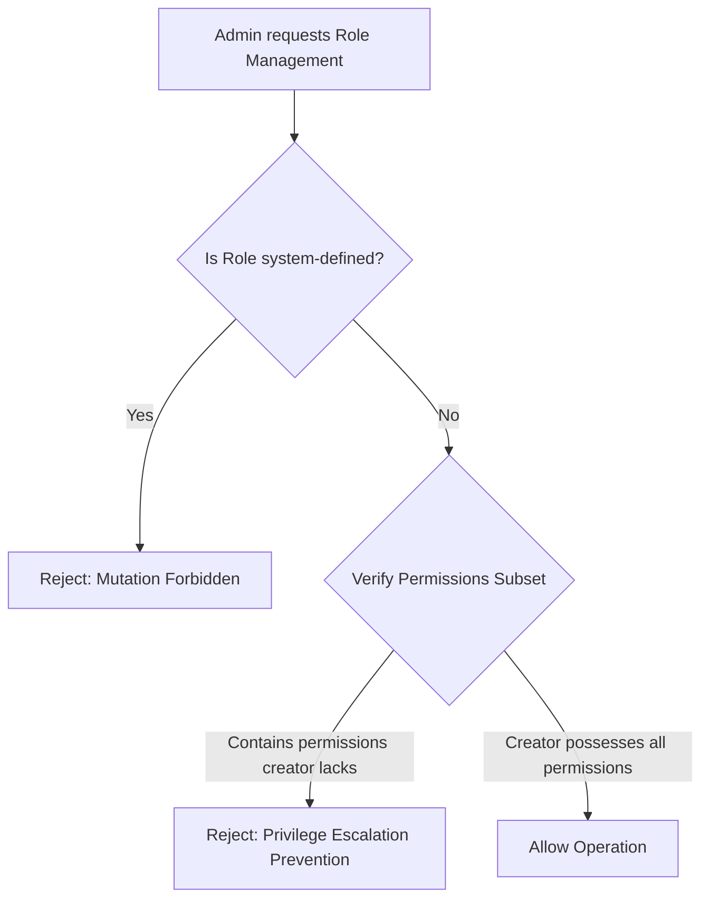

# ADR 012: Role Management, Protection Rules and Privilege Escalation Prevention

## Status
Approved

## Context
With the introduction of custom organization-level roles, organization administrators will be able to create, update, and delete roles. To prevent privilege escalation and secure core system operations, we require strict validation and authorization rules:

1. **System vs. Custom Roles**: The system contains default seeded roles (`Owner`, `Admin`, `Member`, `Platform Support`) which have a null `organization_id`. These are global system roles. Custom roles are tenant-bound, possessing a non-null `organization_id`.
2. **Privilege Escalation**: An administrator with a subset of permissions must not be allowed to create a role that has permissions they do not possess, nor assign a role with higher permissions to another user.
3. **System Role Protection**: System roles must be protected from deletion or modification by organization administrators.
4. **Last Owner Protection**: Every tenant organization must always retain at least one membership possessing the `Owner` system role to prevent organizations from becoming ownerless.

## Decision
We enforce the following architectural rules and designs:

### 1. Unique Constraints & Model Invariants
* Add a database constraint: `UniqueConstraint("organization_id", "name", name="uq_role_org_name")`. If `organization_id` is null, the name is unique among system roles.
* Custom roles are strictly scoped: `is_system` is set to `False` for all user-created roles, and `organization_id` must match the creator's organization.

### 2. Privilege Escalation Prevention Policy
When creating or updating a custom role, or assigning a role to a membership, the system runs the following validations:
* **Role Creation/Update**: The list of permissions assigned to the new role must be a subset of the creator's own effective permissions in that organization.
* **Role Assignment**: The administrator assigning a role to another membership must possess all permissions that the target role contains.

### 3. Role Protection Rules
* **No Deletion/Modification of System Roles**: Any request to edit or delete a role where `is_system == True` returns `403 Forbidden`.
* **Last Owner Protection**: A request to delete, suspend, or change the role of the last membership with the system `Owner` role is rejected with a validation error.

### 4. Effective Permission Resolution
* Expose `GET /api/v1/organizations/{organization_id}/members/me/effective-permissions` which flattens the user's active membership roles and returns the complete set of unique permission keys. This allows the frontend client to perform conditional rendering securely.

## Consequences
* Enhanced security: Organization administrators cannot elevate their own privileges or bypass organizational authorization limits.
* Invariant protection: Critical platform system roles remain immutable, and tenant organizations will never become ownerless.
* Client-side optimization: The effective permissions endpoint enables responsive conditional UI element visibility.
