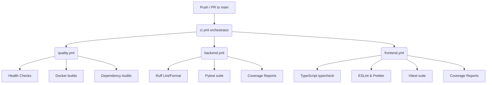

# OmniVote Continuous Integration (CI) Guidelines

This guide details the Automated Continuous Integration pipeline built on GitHub Actions, local commands for developers before pushing, and recommendations for repository branch protection.

---

## 1. CI Workflow Overview

The CI validation pipeline resides under [.github/workflows/](file:///c:/Users/DELL/omnivote/.github/workflows/) and consists of:



### Build Artifacts
Every build compiles and uploads:
- `backend-coverage-html`: Full HTML coverage report for Python classes.
- `backend-coverage-xml`: Coverage XML for external integrations (`coverage.xml`).
- `frontend-coverage-html`: Detailed HTML site showing covered client scripts.
- `frontend-coverage-xml`: Clover XML format.
- **Retention Period**: Files are kept for 7 days.

---

## 2. Local Validation (Before You Push)

To avoid pipeline failure on pull requests, run these checks locally:

### 1. Codebase Health & Lints
```bash
# Verify YAML file formatting
python3 -c "import yaml, glob; [yaml.safe_load(open(f)) for f in glob.glob('**/*.yml', recursive=True)]"

# Format & Lint checks (Backend)
ruff check .
ruff format --check .

# Format & Lint checks (Frontend)
npm run lint
npm run format:check
```

### 2. Run Test Suites
```bash
# Backend Pytest run
pytest

# Frontend Vitest run
npm run test
```

### 3. Dependency Security Audits
```bash
# Python audit
pip install pip-audit && pip-audit -r requirements.txt

# Node audit
npm audit --audit-level=moderate
```

---

## 3. Recommended GitHub Branch Protection Rules

To enforce the quality gate foundation, configure the following Branch Protection Rules on your GitHub repository settings under `Branches > Add rule`:

1. **Protect Branch name**: `main`
2. **Require a pull request before merging**: 
   - Check `Require approvals` (minimum 1 approval recommended).
   - Check `Dismiss stale pull request approvals when new commits are pushed`.
3. **Require status checks to pass before merging**:
   - Check `Require branches to be up to date before merging`.
   - Search and select these checks as mandatory:
     - `Quality`
     - `Backend`
     - `Frontend`
4. **Restrict force pushes**:
   - Check `Block force pushes` to prevent history modification on main.

---

## 4. Troubleshooting Workflow Failures

### 1. Active Merge Conflict Markers Detected
If `quality.yml` fails on "Check for merge conflict markers", a file contains unmerged Git dividers (`<<<<<<<`, `=======`, `>>>>>>>`). Locate them using:
```bash
git grep -n -E '^(<<<<<<<|=======|>>>>>>>)'
```
Resolve the conflicts, stage the file, and re-commit.

### 2. Oversized Files (>10MB)
Git is not designed to track large binary files. If a database dump or media file > 10MB was accidentally added, remove it from git history or use Git LFS.

### 3. Committed Secrets Scan Warning
If the scan warns of potential secrets:
```
Warning: Potential secrets committed in plain text.
```
Double-check that you haven't committed hardcoded passwords, tokens, or private `.env` credential files.

---

## 5. Future CD Roadmap

Once ready for production hosting, the pipeline can be extended to support Continuous Delivery (CD):

1. **Staging / QA Deploy (Automatic)**:
   - Triggered on push to `main` (after CI succeeds).
   - Builds production Docker images, pushes them to GitHub Container Registry (GHCR) or AWS ECR, and deploys them to staging.
2. **Production Deploy (Manual Approval)**:
   - Triggered via GitHub Releases or workflow dispatch.
   - Requires manual peer approval inside GitHub Actions environments before deploying to production.
